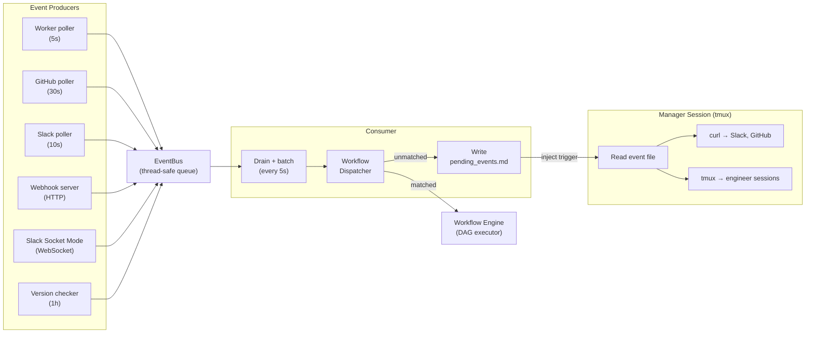
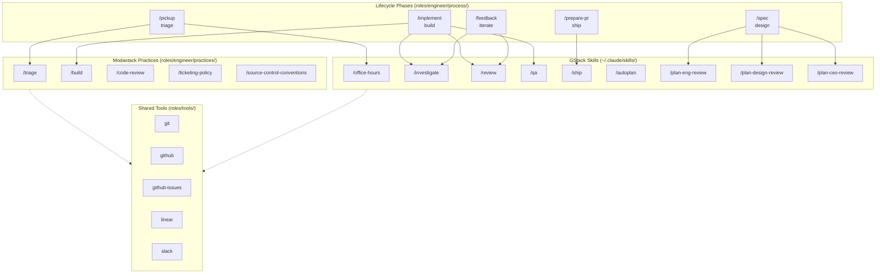
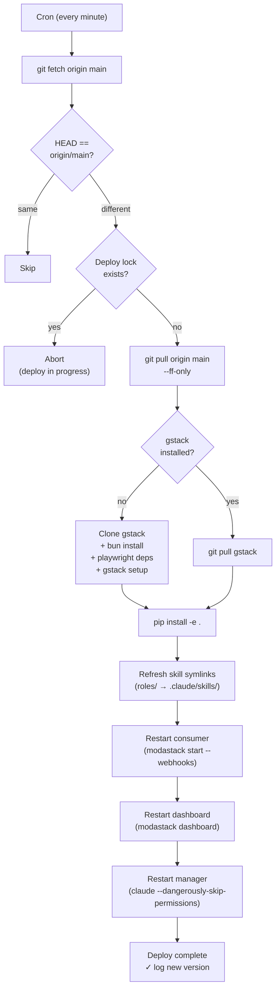
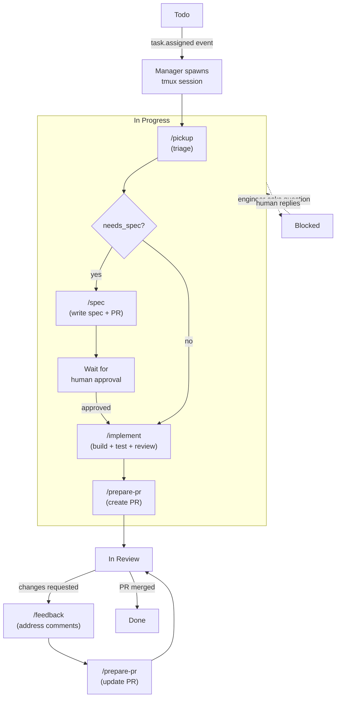

# modastack

Event-driven AI engineering team. A persistent Claude Code manager monitors GitHub, Slack, and engineer sessions — assigning work, routing phases, answering questions, and communicating with humans. Engineers are Claude Code sessions in tmux that execute skills for each phase of the development lifecycle.

## How it works

modastack has five core principles:

1. **Skills first** — each phase of work (triage, spec, implement, ship, feedback) is a self-contained skill. Skills are portable — they work both unattended via the manager and manually in Claude Code.

2. **Persistent tmux sessions** — each issue gets one interactive Claude Code session in tmux that persists across phases. The manager injects skill invocations into the same session instead of spawning new processes. Context carries forward naturally.

3. **Event-driven architecture** — events from GitHub, Slack, and engineer sessions flow through an in-process bus. The consumer batches events and feeds them to the persistent manager session, which reasons about what to do next.

4. **Manager-driven orchestration** — the manager is a long-lived interactive Claude Code session that reads event files and acts directly. It uses curl for external APIs (Slack, GitHub) and tmux commands for engineer sessions. No hard-coded routing rules, no executor — the manager reasons about the full picture and handles everything via tools.

5. **Workflow engine** — deterministic YAML DAGs with hybrid LLM reasoning. Each workflow is a directed acyclic graph of typed nodes (bash, action, prompt, manager, approval, gate) executed in topological order. Deterministic nodes guarantee reliable side effects (Slack posts, ticket moves), while manager nodes consult the LLM session for reasoning. Workflows are event-triggered — the consumer matches incoming events against YAML trigger definitions and dispatches automatically. State persists to disk, so workflows survive restarts and can resume from the last completed node.

6. **Composable skills** — skills come from two layers that compose at runtime. Modastack ships process skills (pickup, spec, implement, prepare-pr, feedback), practice skills (triage, build, code-review), tool references (git, github, linear, slack), and product manager skills (brand-identity, design-critic). Methodology skills (review, ship, autoplan, investigate, office-hours, qa, plan-*-review) come from [GStack](https://github.com/garrytan/gstack) installed at user-level (`~/.claude/skills/`). Claude Code's built-in skill resolution merges both layers — repo-level symlinks and user-level skills are all available in engineer sessions.

### Workflow resolution

Workflow definitions are resolved via a three-tier priority chain (most specific wins):

1. **Repo-specific** (`<repo>/.modastack/workflows/`) — custom lifecycles for a single repo
2. **User overrides** (`~/.modastack/workflows/`) — personal workflow tweaks across all repos
3. **Built-in defaults** (`workflows/`) — modastack's standard workflows (issue-lifecycle, pr-feedback, etc.)

When an event arrives, the dispatcher loads workflows from all three sources and picks the most specific match. A repo-specific workflow only matches events from that repo. Within the same tier, the first match wins. This lets repos ship custom lifecycles that override the defaults without forking modastack.

### Event normalization

Both GitHub Issues and Linear emit events in different formats. The event system normalizes them to a common `task.*` schema so workflows trigger on `task.assigned`, `task.created`, etc. regardless of the source:

| Source event | Normalized event |
|---|---|
| GitHub `issues.opened` | `task.opened` |
| GitHub `issues.assigned` | `task.assigned` |
| GitHub `issues.closed` | `task.closed` |
| Linear `Issue.create` | `task.created` |
| Linear `Issue.update` + assignee | `task.assigned` |
| Linear `Issue.update` + state "Done" | `task.closed` |
| Linear `Issue.remove` | `task.closed` |

For Linear events, the webhook handler resolves the project prefix (e.g., `AGD` from `AGD-12`) to a repo path via the global config, so workflows can match events to the correct repo.

### Event flow

```
Event producers (threads)          Event bus          Consumer          Manager session
─────────────────────────          ─────────          ────────          ───────────────

Worker poller (5s)    ──┐
GitHub poller (30s)   ──┤
Slack poller (10s)    ──┼──→  thread-safe  ──→  drain + batch  ──→  write to file
Webhook server (HTTP) ──┤      queue            format events       + inject trigger
Slack Socket Mode     ──┤                                           into manager tmux
Version checker (1h)  ──┘
                                                                    Manager reads file,
                                                                    acts directly:
                                                                    ├─ curl for APIs
                                                                    │  (Slack, GitHub)
                                                                    └─ tmux for engineers
                                                                       (spawn, inject, kill)
```

Events arrive from multiple sources — pollers run in background threads, webhooks via an HTTP server, and Slack via Socket Mode WebSocket. All push to the same in-process bus. The consumer drains the bus every few seconds, writes events to `~/.modastack/manager/pending_events.md`, and injects a short trigger message into the manager's tmux session. The manager reads the event file and acts directly — no intermediate executor or JSON action protocol.



### Task tracking

modastack supports pluggable task tracking systems:

- **GitHub Issues (default)** — uses `gh` CLI for authentication. Issues are labeled with `status:todo`, `status:in-progress`, `status:blocked`, `status:in-review`. No API key needed.
- **Linear (optional)** — pass `--linear-key` and `--linear-project` during setup. Uses GraphQL API for polling and mutations.

The system defaults to GitHub Issues without prompting. All pollers and webhooks emit generic `task.*` events regardless of which backend is configured.

### Handoff contract

Engineers write `~/.modastack/handoffs/<issue_id>.md` to track phase state:

```yaml
---
issue_id: AGD-12
title: Add rate limiting
worktree: /path/to/worktree
branch: agent/agd-12
phase: implementation_complete
complexity: medium
needs_spec: true
spec_path: specs/agd-12-rate-limiting.md
---

## Status
Implementation pushed. 3 files changed.
```

The manager reads handoff files and event data to decide which skill to route next.

### Phase routing

The manager maps handoff phases to skills:

| Handoff phase | Next skill | Condition |
|---|---|---|
| `triage_complete` | `/spec` | `needs_spec: true` |
| `triage_complete` | `/implement` | `needs_spec: false` |
| `spec_complete` | (wait) | human must reply "approved" |
| `implementation_complete` | `/prepare-pr` | |
| `feedback_addressed` | `/prepare-pr` | |
| `in_review` | (wait) | human reviews PR |
| `blocked` | (wait) | human must reply |

### Stall detection

The worker poller monitors engineer sessions with heartbeat-based output hashing:

| Event | Trigger | Manager action |
|---|---|---|
| `worker.stalled` | No output for 5 minutes | Check session, nudge or re-inject |
| `worker.stuck` | No output for 10 minutes | Kill and respawn |
| `worker.permission_blocked` | Session stuck on interactive approval | Inject approval or escalate |
| `worker.process_dead` | Dead Claude process detected | Respawn session |

### Sub-agents

Within each phase, the skill uses sub-agents to keep context isolated:

```
/pickup
├── Sub-agent: explore codebase → returns relevant files + complexity
└── Self: triage, write handoff

/implement
├── Sub-agent: write tests → commits test files
├── Sub-agent: implement → commits code
├── Sub-agent: review → checks diff only
└── Self: push
```

Each sub-agent gets only the context it needs. The implement sub-agent never sees the test-writing process. The reviewer only sees the diff.

### Question bridging

When an engineer asks a question (via `AskUserQuestion`), the worker poller detects it from the tmux pane and pushes a `worker.asking_question` event. The manager sees the event, reasons about whether it can answer from context, and either answers directly or posts the question to Slack and waits for a human reply.

### Skill integration

Every dispatch phase uses skills to enforce a real engineering lifecycle. No phase ships without quality gates.

| Dispatch phase | Skills used | What they do |
|---|---|---|
| `/pickup` (triage) | `/triage` | Classify: update / inquiry / bug |
| | `/office-hours` | Complex/ambiguous issues → structured design doc |
| `/spec` (design) | `/plan-eng-review` | Architecture, edge cases, test coverage |
| | `/plan-design-review` | UX review, design dimensions scored 0-10 |
| | `/plan-ceo-review` | Scope review: too narrow? too wide? |
| `/implement` (build) | `/investigate` | Bugs only — root cause analysis before any fix |
| | `/build` | Staff engineer coding methodology |
| | `/review` | **Mandatory** pre-landing code review |
| | `/qa` | Browser-based QA (web frontends only) |
| `/prepare-pr` (ship) | `/ship` | Full ship workflow: test, review, create PR |
| `/feedback` (iterate) | `/investigate` | If feedback points to a bug |
| | `/review` | **Mandatory** review of fixes before pushing |

Key enforcement points:
- **`/review` is mandatory** in both `/implement` and `/feedback`. Code cannot advance to PR without passing code review.
- **`/investigate` before fixing bugs.** No guessing at fixes — root cause first (Iron Law).
- **Triple review on specs.** Non-trivial specs get engineering, design, and CEO-level scope review before implementation starts.
- **`/ship` handles PR creation.** Agents don't use raw `gh pr create` — `/ship` runs tests, reviews the diff, and creates a proper PR.

The following diagram shows how modastack-native skills in `roles/` compose with user-level GStack skills from `~/.claude/skills/`, and which skills each lifecycle phase invokes.



## Setup

```bash
git clone https://github.com/moda-labs/modastack.git ~/dev/modastack
cd ~/dev/modastack
python3 -m venv .venv
source .venv/bin/activate
pip install -e .
modastack init
```

### Per-repo setup

```bash
# GitHub Issues (default — no API key needed)
modastack register ~/path/to/repo

# Or with Linear
modastack register ~/path/to/repo --linear-key <KEY> --linear-project <PROJECT>

# Remote repos (auto-clones via gh)
modastack register org/repo
```

`register` handles the full setup: generates `.modastack.yaml`, bootstraps labels (GitHub) or workflow states (Linear), adds `.modastack/` and `worktrees/` to `.gitignore`, installs engineer skills as symlinks, and registers the repo in `~/.modastack/config.yaml`.

### Commands

```bash
modastack start                    # start event loop (polling mode)
modastack start --webhooks         # start with webhook server + polling
modastack start --webhooks --port 9090
modastack tick                     # check manager session state
modastack tick "message"           # inject a message into the manager session
modastack status                   # show active engineer sessions
modastack events                   # show recent events from the bus
modastack decisions                # show recent manager decisions
modastack init                     # initialize global config
modastack register <target>        # register a repo + full setup (local path or org/repo)
modastack setup [path]             # set up a repo — install skills, store credentials, register
modastack repos                    # list registered repos
modastack dashboard                # start web dashboard (default port 8095)
modastack history index            # index conversation JSONL into searchable SQLite
modastack history search <query>   # full-text search across conversation history
modastack history sessions         # list indexed conversations
modastack history show <id>        # show messages from a specific session
modastack workflow list            # list available workflow definitions
modastack workflow status          # show active and recent workflow runs
modastack workflow validate <path> # validate a workflow YAML file
modastack self-update              # pull from origin/main + reinstall
modastack rollback                 # restore to pre-update state
```

### Web dashboard

`modastack dashboard` starts a FastAPI web UI with three panels:

- **Active sessions** — live tmux state for all engineer sessions
- **Event log** — filterable by source/type, paginated
- **Recent decisions** — manager decision history

No new data stores — reads existing JSONL logs and tmux state.

### Self-updating

modastack checks for updates hourly by comparing against `origin/main`. When a new version is available, the manager posts to Slack for approval. `modastack self-update` pulls, stashes any dirty state, and reinstalls. `modastack rollback` restores the pre-update state if something breaks.

### Deploy pipeline

The deploy pipeline runs via cron (every minute). `check-deploy.sh` compares the local HEAD against `origin/main` and triggers `auto-deploy.sh` when new commits are detected.



## Configuration

### Global config (`~/.modastack/config.yaml`)

All repo settings live here. Run `modastack register` to add a repo:

```yaml
slack:
  bot_token: xoxb-...
  app_token: xapp-...
webhooks:
  port: 8080
repos:
  - /home/user/dev/myproject
```

### Per-repo config (`.modastack.yaml`)

Generated by `modastack register`, lives in the repo root:

```yaml
task_tracking:
  system: github-issues    # or "linear"
  project: MY              # label/project prefix
  trigger_labels:
    - agent
```

### Credentials (`~/.modastack/credentials.yaml`)

Per-project API keys (Linear, etc.). GitHub Issues uses `gh` CLI auth — no key needed.

## Issue lifecycle

GitHub Issues labels: **status:todo → status:in-progress → status:in-review → Done** (+ status:blocked)

Linear states (if configured): **Todo → In Progress → In Review → Done** (+ Blocked)

```
Todo
  │  Manager spawns tmux session + injects /pickup, moves to In Progress
  ▼
In Progress
  │  /pickup triages → writes handoff
  │  Manager reads events → injects /spec or /implement into same session
  │  /spec writes spec → waits for approval
  │  Human replies "approved" → manager injects /implement
  │  /implement builds, tests, pushes → writes handoff
  │  Manager injects /prepare-pr → creates PR → moves to In Review
  ▼
In Review
  │  Human reviews PR
  │  ├─ Changes requested → manager injects /feedback
  │  └─ PR merged → manager moves to Done
  ▼
Done
```

**Blocked** — when an engineer asks a question, the manager detects it via the worker poller, posts it to Slack, and waits. When a human replies, the event flows through the bus and the manager injects the answer back into the engineer's session.

The following diagram shows the full issue lifecycle including internal sub-phases within "In Progress" and the skills that fire at each stage.



## Project structure

```
modastack/                        # CLI + infrastructure
├── cli.py                        # Click CLI entrypoint
├── config.py                     # Global config (~/.modastack/config.yaml)
├── github_issues.py              # GitHub Issues scanning + label bootstrap
├── scanner.py                    # Linear GraphQL polling
├── session.py                    # Engineer tmux session management (spawn, inject, capture)
├── setup.py                      # Repo setup — skill install, auto-detection
├── board_setup.py                # Bootstrap Linear board with workflow states
├── history.py                    # Conversation history indexer (SQLite + FTS5)
├── __version__.py                # Version string from VERSION file
└── workflow/                     # YAML DAG workflow engine
    ├── schema.py                 # Workflow/node schema, YAML parsing, topological sort
    ├── engine.py                 # DAG executor — node dispatch, state polling, resume
    ├── state.py                  # JSON persistence for workflow runs
    ├── triggers.py               # Event→workflow matching and dispatch
    ├── actions.py                # Action registry (slack.post, ticket.move, etc.)
    └── variables.py              # Variable resolution, safe condition evaluation

workflows/                        # Workflow definitions (YAML DAGs)
├── issue-lifecycle.yaml          # Full issue pickup → triage → spec → impl → review
├── pr-feedback.yaml              # PR change-request handling
├── pr-merged.yaml                # Post-merge cleanup
├── slack-question.yaml           # Engineer question bridging
└── stall-recovery.yaml           # Stalled session detection and recovery

manager/                          # Persistent manager + event system
├── session.py                    # Manager tmux session (start, resume, inject, capture)
├── prompt.md                     # Manager personality, decision rules, available actions
└── events/
    ├── bus.py                    # Thread-safe in-process event queue
    ├── consumer.py               # Drain bus → write events file → trigger manager
    ├── pollers.py                # Background threads: workers (5s), task tracking (30s),
    │                             #   Slack (10s), version check (1h)
    ├── webhook_server.py         # HTTP endpoints: /webhooks/github, /linear, /slack
    └── slack_socket.py           # Slack Socket Mode WebSocket client

dashboard/                        # Web dashboard
├── app.py                        # FastAPI app — sessions, events, decisions panels
├── data.py                       # Event log parsing + tmux state detection
└── templates/index.html          # Web UI

engineer/                         # Engineer skills
├── process/                      # Manager-routed lifecycle phases
│   ├── pickup/SKILL.md           # Take ticket, create worktree, triage
│   ├── spec/SKILL.md             # Write implementation spec
│   ├── implement/SKILL.md        # Build from spec, TDD, sub-agents
│   ├── prepare-pr/SKILL.md       # Create/update PR
│   └── feedback/SKILL.md         # Address review comments
└── practices/                    # Methodology skills
    ├── triage/SKILL.md           # Task intake & classification
    ├── build/SKILL.md            # Staff engineer coding methodology
    ├── code-review/SKILL.md      # Mandatory quality gates
    ├── ticketing-policy/SKILL.md # Who moves tickets when
    ├── source-control-conventions/SKILL.md
    ├── review/SKILL.md           # Pre-merge code review
    ├── investigate/SKILL.md      # Root cause debugging
    ├── ship/SKILL.md             # Ship workflow: test, review, PR
    ├── autoplan/SKILL.md         # Review pipeline: CEO → design → eng
    ├── plan-eng-review/SKILL.md  # Architecture review
    ├── plan-design-review/SKILL.md # UX review
    ├── plan-ceo-review/SKILL.md  # Scope review
    ├── office-hours/SKILL.md     # Structured design doc / brainstorm
    └── qa/SKILL.md               # Browser-based QA (needs browse binary)

product_manager/                  # Product manager skills (standalone)
├── brand-identity/SKILL.md       # Brand discovery & visual identity
└── design-critic/SKILL.md        # Adversarial design doc reviewer

tools/                            # Shared tool reference (used by manager + engineers)
├── git/SKILL.md                  # Git CLI commands
├── github/SKILL.md               # gh CLI commands
├── github-issues/SKILL.md        # GitHub Issues API reference
├── linear/SKILL.md               # Linear GraphQL API
├── slack/SKILL.md                # Slack setup & API
├── webhooks/SKILL.md             # Webhook setup guide
└── notion/SKILL.md               # Notion integration (placeholder)
```

## Design decisions

| Decision | Rationale |
|----------|-----------|
| Skills first | Each phase is a self-contained skill — portable, testable, works manually or via the manager |
| Persistent tmux sessions | One session per issue, reused across phases. Context carries forward, no cold starts |
| Event-driven bus | Decouples event sources from the manager. Adding a new source means writing one poller or webhook handler — push to the bus |
| Persistent manager session | Long-lived interactive Claude Code in tmux. Survives restarts via `--resume`. Reads event files and acts directly using tools |
| File-based event delivery | Consumer writes events to a file instead of injecting long text into tmux (paste buffer is unreliable). Manager reads the file reliably |
| Manager uses curl | MCP tools have built-in write confirmations that block automation. The manager calls APIs directly via curl for Slack and GitHub |
| No executor | The manager handles everything directly — curl for APIs, tmux commands for engineer sessions, bash for everything else. No intermediate action protocol |
| Handoff contract | `~/.modastack/handoffs/<id>.md` is the interface between phases — minimal, structured |
| Sub-agents | Context isolation within phases. Reviewer only sees the diff, not the spec |
| Question bridging | Agent questions detected via worker poller, manager decides how to answer — directly or escalate to human |
| Stall detection | Heartbeat-based output hashing detects stuck sessions. Manager auto-routes: nudge, respawn, or escalate |
| GitHub Issues default | No API key needed — uses `gh` CLI auth. Linear available as an option for teams already using it |
| Acknowledge first | Manager posts a short Slack ack before starting long-running work, so humans know it's being handled |
| Daemon, not cron | Inherits full shell environment (Keychain, OAuth). No cron env issues |
| Centralized config | All repo settings in `~/.modastack/config.yaml`. No modastack files in target repos except `.modastack.yaml` |
| Webhooks + polling | Webhooks for real-time events when available, pollers as fallback. Both push to the same bus |
| Slack Socket Mode | WebSocket connection to Slack — no public URL needed, real-time DMs and mentions |
| Self-updating | Hourly version check against origin/main. Slack approval before updating. Rollback available if something breaks |

## Tests

```bash
source .venv/bin/activate
pip install -e ".[dev]"
pytest tests/ --ignore=tests/integration/
```

Do NOT run `tests/integration/` — they create real tmux sessions and issues.

## Extra setup

**`/qa`** — requires the gstack `browse` binary (a compiled Playwright wrapper for headless browser testing). Without it, the skill can't take snapshots or interact with web pages. Install gstack separately or skip `/qa` and have engineers do browser testing manually.

**`brand-identity`** (in `product_manager/`) — references gstack's `design` binary and `~/.gstack/projects/` paths. Needs rewriting to work standalone. Not part of the automated ticket pipeline.

Practice skills (`/review`, `/investigate`, `/ship`, `/autoplan`, `/plan-eng-review`, `/plan-design-review`, `/plan-ceo-review`, `/office-hours`) were adapted from [gstack](https://github.com/garrytan/gstack) (MIT license).
