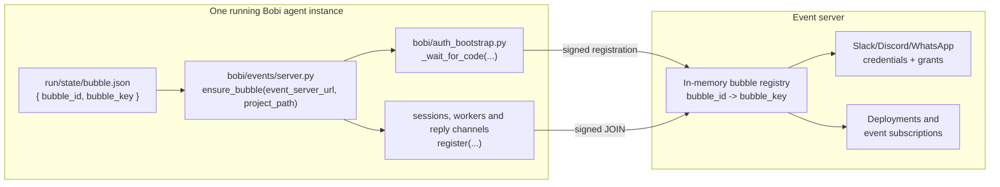
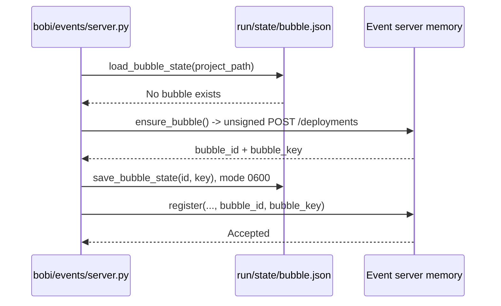
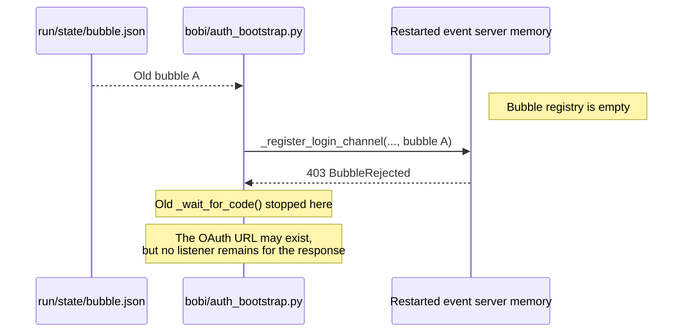
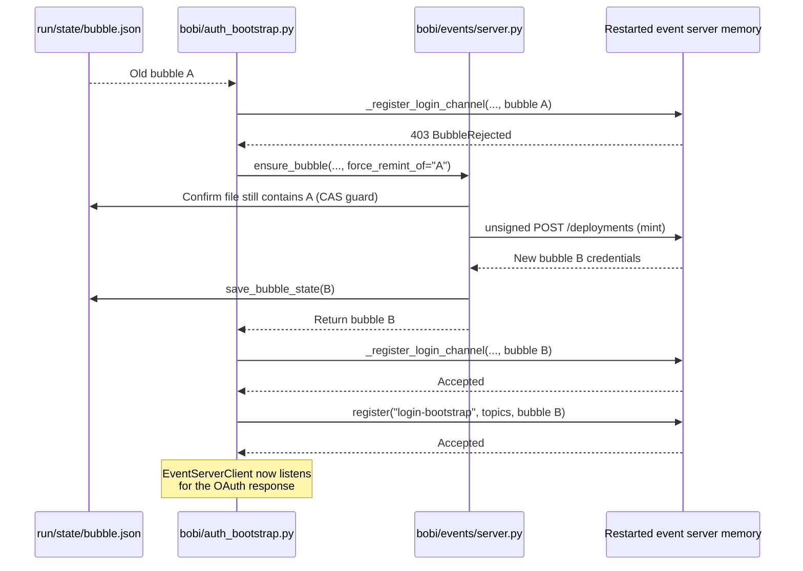
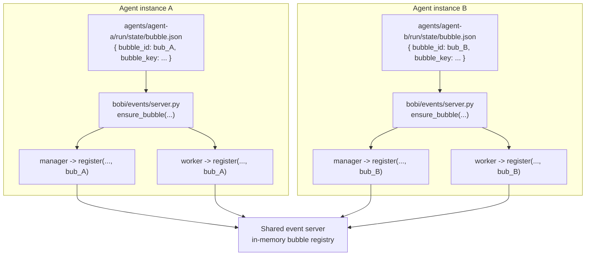
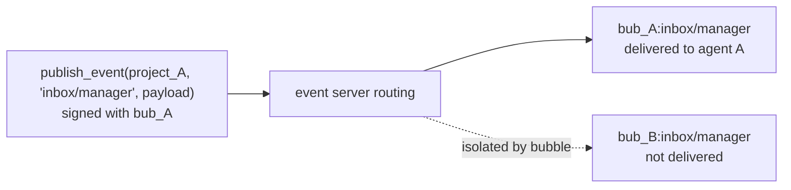
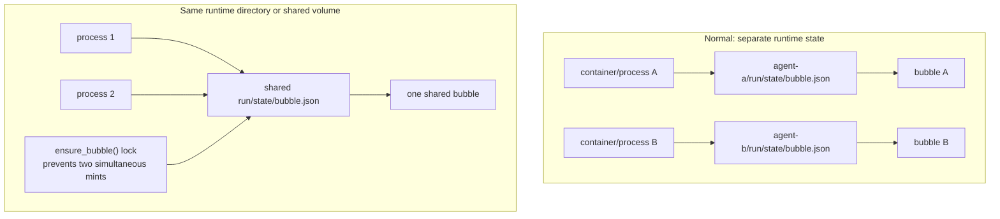

# Bobi bubble explained

A **bubble** is Bobi's security boundary for one agent instance. It groups
deployments, channel credentials, permissions, and event subscriptions so they
cannot be used by another agent instance.

It consists of:

```text
bubble_id   -> public identifier
bubble_key  -> secret used to sign requests
```

The credentials are persisted in each running agent instance at
`run/state/bubble.json`. The local event server keeps its recognized bubbles in
memory.



## Normal first boot



## MOD-307 failure

The event server restarts and forgets its in-memory bubbles, but `bubble.json`
survives:



## MOD-307 recovery



The "replace only if still A" operation is a compare-and-swap guard. If two
processes recover simultaneously, the second process sees that another process
already created bubble B and reuses it instead of creating bubble C.

## Multiple Bobi agents

Each **running named-agent instance** normally has its own runtime directory and
therefore its own `state/bubble.json`. Sessions, workers, sub-agents, and reply
channels inside that instance share its bubble.



Although both managers subscribe to `inbox/manager`, the event server scopes
non-global topics by bubble:



## Separate state versus shared state



- Separate runtime state produces separate security boundaries.
- Processes sharing the same runtime state converge on one bubble and are
  treated as parts of the same security instance.
- Sharing an event server is safe: different bubbles isolate identically named
  non-global topics.
- Sharing a runtime directory is not the same as running isolated agents and
  can introduce manager or state-file contention.
