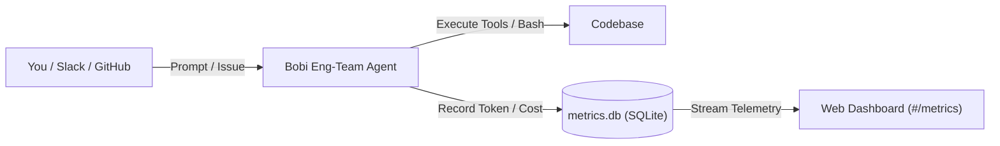

# Quickstart: Setup Your Eng-Team Bot & Track Metrics

This guide shows you how to set up, run, and test an automated engineering team bot (`eng-team`) with **live token metrics and cost tracking** in under 5 minutes.

---

## 1. Quick Concept



Every command, tool execution, LLM call, token count, and USD cost is automatically tracked in a local SQLite database and visualized on your web dashboard.

---

## 2. 3-Step Setup

### Step 1: Create Your `.env` File

In your workspace root, create a `.env` file.

#### Option A: Minimal Setup (Direct Anthropic)
If you are using Anthropic API directly:

```bash
# 1. Enable metrics collection (Required)
BOBI_METRICS_MODE=enabled

# 2. LLM Provider settings
ANTHROPIC_API_KEY=sk-ant-api03-xxxx...
LLM_MODEL=claude-3-5-sonnet-20241022
```

#### Option B: AI Gateway / Proxy Setup (Cloudflare, OpenRouter, DeepSeek)
If your team routes requests through a unified gateway:

```bash
# 1. Enable metrics collection (Required)
BOBI_METRICS_MODE=enabled

# 2. Gateway provider settings
ANTHROPIC_API_KEY=your_gateway_token_here
ANTHROPIC_BASE_URL=https://gateway.ai.cloudflare.com/v1/{account_id}/{gateway_id}/anthropic
LLM_MODEL=deepseek-flash
```

---

### Step 2: Verify & Start the Bot

Run the preflight check to confirm your environment is healthy:

```bash
bobi agent eng-team doctor
```

Then start the Bobi web app and daemon:

```bash
bobi app start
```

The command will output your local web dashboard link with a security token:
```
bobi app is running at http://127.0.0.1:8642/?n=<security_token>
```

Open that link in your browser!

---

### Step 3: Run a Test Task

Send a quick test prompt to your bot from your terminal:

```bash
bobi agent eng-team message "Check git status, list recent commits, and verify test status."
```

Or type your prompt directly into the **Composer** box at the bottom of the Web UI (`#/agents/eng-team`).

---

## 3. Viewing Your Metrics

Once the bot finishes its task, open the Metrics Dashboard:

👉 **`http://127.0.0.1:8642/?n=<token>#/agents/eng-team/metrics`**

### What to Look For:

1. **Top KPI Strip**:
   * **Input Tokens**: Total tokens sent to the model (+ cache read tokens).
   * **Output Tokens**: Exact tokens generated by the model.
   * **Prompt Cache Hits**: Percentage and count of cached tokens (e.g. `90.9% cache hit ratio`).
   * **Total Spend (USD)**: Exact dollar cost reported by the provider (e.g. `$0.3195`).

2. **Scope Indicator**:
   * `🌐 Scope: Entire Fleet · all sessions in eng-team`: Shows aggregated stats across all runs in the last 24h.
   * `🎯 Scope: Session "<id>"`: Shows stats isolated to a single task lifecycle when filtered.

3. **Turn Detail Drawer**:
   * Click any row in the **Recent Turns** table.
   * **`Model (selected / req)`**: See the model actually used (highlighted in purple badge) and the requested model in parentheses.
   * **`Action / Stop Reason`**: Click the **`🔧 Bash ×2`** badge to jump straight to the **Tools Executed** tab.
   * **`Tools Executed Tab`**: Check execution time (ms), input/output payload byte sizes (`45 B in / 1.2 KB out`), and status.

4. **Dark Slab Modal (Inside Runs Table)**:
   * Go to `#/agents/eng-team` and click on any finished run in the **Runs** table.
   * Click the **usage** tab at the top.
   * Inspect the dark-themed metrics drawer without leaving the run context. Click **`← Back to turns list`** to navigate between turns.

---

## 4. Optional Configurations (For Production Teams)

If you are setting up `eng-team` for an entire engineering organization, add these optional integrations to your `.env`:

### GitHub Automation (Issues & PR Reviews)
```bash
# GitHub Personal Access Token (requires repo & workflow scopes)
GH_TOKEN=ghp_your_github_token_here
```
*When configured, the bot automatically picks up issues assigned to it and reviews PRs when requested.*

### Slack Chat Integration
```bash
SLACK_BOT_TOKEN=xoxb-...
SLACK_APP_TOKEN=xapp-...
SLACK_SIGNING_SECRET=...
# Optional: restrict bot to specific channels
SLACK_CHANNELS=C0123456789
```

### JEV Smart Model Routing (A/B Testing & Dynamic Model Switching)
```bash
BOBI_METRICS_ASSIGNMENT_SECRET=your_32_character_secret_key
BOBI_METRICS_EXPERIMENT_JSON='{
  "experiment_id": "eng-team-routing-v1",
  "policy": {
    "mode": "enforce",
    "endpoint": "https://policy.internal.example.com/v1/decision"
  },
  "variants": [
    { "variant_id": "control", "model": "claude-3-5-sonnet-20241022", "weight": 0.5 },
    { "variant_id": "treatment_flash", "model": "deepseek-flash", "weight": 0.5 }
  ],
  "scope": {
    "entry_points": ["subagent_persistent", "subagent_phase", "workflow_start"],
    "roles": ["engineer"]
  }
}'
```

---

## 5. Troubleshooting & FAQ

#### Q: The Metrics Dashboard shows "No recorded turns" or 0 tokens.
**Fix**: Ensure `BOBI_METRICS_MODE=enabled` is present in your `.env`. If you just added it, restart the app:
```bash
bobi app restart
```

#### Q: How do I view raw system logs if an API error occurs?
**Fix**: In the Web UI, click the **Logs** button in the top navigation bar, or run:
```bash
tail -f ~/.bobi/agents/eng-team/run/state/manager.log
```

#### Q: How do I test the metrics UI in automated tests?
Run the full test suite with Playwright:
```bash
pytest tests/e2e/test_webapp_ui.py::TestMetricsView
```
