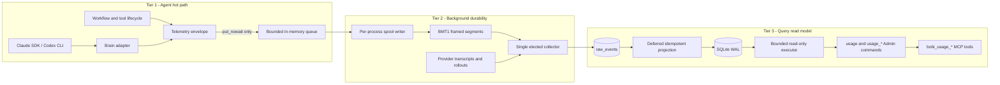
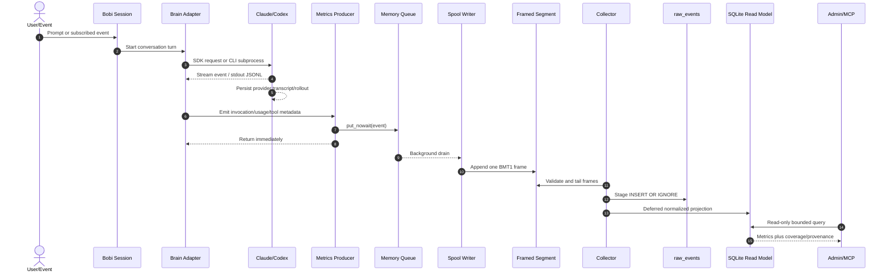
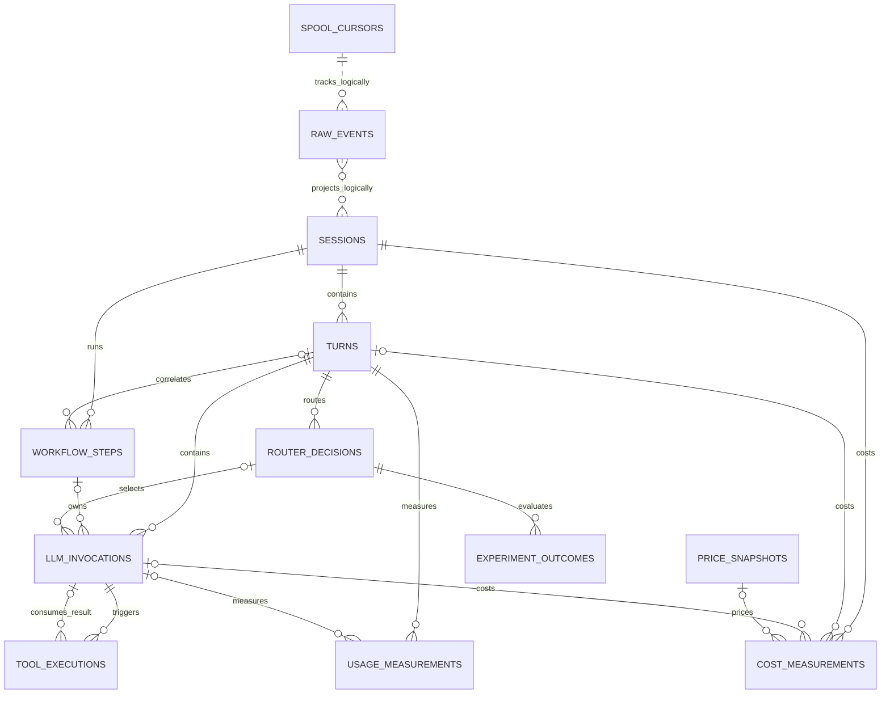

# Fine-Grained Metrics and Token Tracking

This document is the implementation and operations guide for Bobi's
fine-grained token, latency, cost, and model-routing telemetry.

> [!IMPORTANT]
> **Implementation status:** the architecture contract is complete, but the
> runtime feature is not implemented yet. Paths under `bobi/metrics/`, the
> `bobi admin metrics_*` aliases, and the `bobi agent <name> metrics ...`
> commands described here are target Phase 0-4 interfaces. The existing
> `usage` Admin command and `bobi_usage_summary` MCP tool are already present.
> Do not interpret a planned command as available until its phase lands.

The executable architecture and phase gates live in
[`plans/2026-09-24-fine-grained-metrics-token-tracking.md`](../plans/2026-09-24-fine-grained-metrics-token-tracking.md).
This guide explains how the pieces fit together and how engineers will build,
test, inspect, and operate them.

## 1. Executive Summary and Mental Model

### The problem

Bobi currently has useful session/job-level usage totals, but those totals do
not answer the questions engineers and operators need during an agentic run:

- Which user turn consumed the most tokens or money?
- Which internal model invocation caused the spike?
- Which tool execution dominated wall time?
- Did a large tool result inflate the next model input?
- Did the JEV router select a cheaper model without reducing task success?
- Is a number provider-reported, locally estimated, or still unknown?

A single user request can produce this sequence:

```text
user prompt
  -> model invocation 1
  -> tool execution 1
  -> model invocation 2
  -> tool execution 2
  -> model invocation 3
  -> final response
```

One turn-level total hides every internal hotspot. Fine-grained telemetry keeps
the conversational turn and its internal work separate while preserving an
exact aggregate where the provider supplies one.

### The three-tier hybrid architecture

Think of the system as a receipt dropbox, a durable mailroom, and a ledger:

1. **Hot-path producer:** the agent drops a tiny receipt into a bounded memory
   queue and immediately continues. It does not open a database or wait for a
   lock.
2. **Durable ingestion:** a background writer frames receipts into a per-process
   append-only spool. One elected collector validates and imports them.
3. **Query read model:** the collector projects immutable raw events into a
   normalized SQLite WAL database. Admin and MCP readers query that database
   through bounded read-only workers.

```text
Tier 1: agent hot path

  [Claude SDK / Codex CLI / workflow / tool]
                       |
                       v
              [put_nowait(event)]
                       |
                       v
             [bounded memory queue]

Tier 2: background durability

             [background spool writer]
                       |
                       v
           [per-process BMT1 segments]
                       |
                       v
          [single supervisor collector]

Tier 3: query and control plane

              [raw_events staging]
                       |
                       v
            [deferred projection]
                       |
                       v
              [SQLite WAL model]
                       |
               +-------+-------+
               |               |
               v               v
          [Admin API]      [MCP tools]
```



### The three guarantees

#### G1. Exact provider parity when exact facts exist

Every provider-reported token dimension must match the independently parsed
provider stream or transcript exactly. This includes normal input/output,
cache reads, TTL-qualified cache writes, and reasoning output where the
provider reports them.

> [!NOTE]
> Exact parity is not a promise to invent data. If a provider does not report a
> dimension, Bobi stores `NULL`. A fallback tokenizer row is explicitly
> `is_estimated = 1` and never becomes billing truth.

#### G2. A bounded critical-path budget

"Zero overhead" is shorthand for a measurable zero-impact contract, not a
literal claim that recording an event costs no CPU:

- one bounded `put_nowait()` operation on the agent path;
- no file, SQLite, network, lock-wait, or `await` operation on that path;
- enqueue p99 at or below **200 microseconds** on the supported benchmark host;
- less than **1%** end-to-end latency regression in deterministic turn replay.

#### G3. Fail-safe isolation

Telemetry is observational. It must never change the agent result:

- a full queue drops telemetry and increments `telemetry_events_dropped`;
- a spool, schema, database, or query failure stays inside the metrics boundary;
- a failed or absent collector does not fail a turn;
- exact provider facts are reconciled later from retained transcripts where
  possible;
- unrecoverable fields remain unknown and appear in coverage counters.

## 2. Architecture and Dataflow

### Turn lifecycle, step by step

The following sequence is the target production flow for one turn.



1. A human message, inbox event, workflow prompt, monitor, or Admin chat starts
   one Bobi conversation turn.
2. Bobi creates stable correlation IDs before internal work begins:
   `session_id`, `turn_id`, and, when applicable, `workflow_step_id` and
   `router_decision_id`.
3. The brain adapter starts or resumes Claude/Codex.
4. Claude emits SDK messages; Codex emits JSONL from `codex exec --json`.
5. The provider independently persists its transcript or rollout. This is the
   reconciliation source after a process crash or dropped online event.
6. The adapter normalizes provider message, invocation, usage, tool, latency,
   and cost facts without discarding provider-specific fields.
7. Bobi builds a metadata-only telemetry envelope. Prompt and tool bodies are
   excluded by default.
8. The producer performs `queue.put_nowait(envelope)` and returns immediately.
9. A background thread serializes canonical UTF-8 JSON into a per-process
   append-only segment.
10. One supervisor-owned collector wins a non-blocking file-lock election.
11. The collector validates each frame and stages it in `raw_events`.
12. Only after staging commits does the collector advance `spool_cursors`.
13. A separate projection pass creates or updates normalized rows in dependency
    order.
14. Read-only query workers serve Admin and MCP requests from SQLite.
15. Reconciliation can later add an exact provider measurement that supersedes
    an earlier estimate without deleting either historical row.

### Provider facts and transcript facts

Claude and Codex already expose exact usage; token estimation is a fallback.

| Provider | Live exact source | Retained exact source | Important caveat |
|---|---|---|---|
| Claude | SDK `AssistantMessage.usage`, `ResultMessage.usage`, `model_usage` | `~/.claude/projects/**/<session>.jsonl` | Repeated rows require message/request ID deduplication |
| Codex | `turn.completed.usage` from `codex exec --json` | `$CODEX_HOME/sessions/**/rollout-*.jsonl` | Repeated `token_count` events must not be blindly summed |

Codex turn totals are a supported contract. Invocation-level reconstruction
from internal rollout events is version-gated: an unknown CLI version keeps the
exact turn total, retains raw events, and reports invocation detail as
unsupported rather than inventing a split.

### Why direct SQLite writes are forbidden on the hot path

Bobi runs multiple concurrent processes: supervisor, manager, persistent
sessions, workflows, detached agents, monitors, and provider CLI children.
SQLite WAL permits concurrent readers, but still has one writer.

A local eight-process probe with 4,000 autocommitted inserts showed the
tradeoff:

| WAL configuration | Successful inserts | Lock errors | Worst successful insert |
|---|---:|---:|---:|
| `busy_timeout=0` | 238 / 4,000 | 3,762 | 0.534 ms |
| `busy_timeout=5000` | 4,000 / 4,000 | 0 | 236.226 ms |

The first configuration loses writes. The second moves contention into tail
latency. Neither is acceptable inside an agent turn.

> [!IMPORTANT]
> WAL is used in the read model, not as permission for every agent process to
> become a writer. The collector is the only SQLite writer.

### Producer envelope

Every event carries enough identity to be replayed and projected idempotently:

```json
{
  "event_id": "019f...",
  "schema_version": 1,
  "event_type": "usage_observed",
  "emitted_at_us": 1790312345678901,
  "producer_id": "pid-4123-boot-...",
  "producer_sequence": 42,
  "session_id": "session-...",
  "turn_id": "turn-...",
  "workflow_step_id": null,
  "invocation_id": "invocation-...",
  "tool_execution_id": null,
  "router_decision_id": null,
  "source": "provider_stream",
  "payload": {
    "provider": "anthropic",
    "model": "claude-...",
    "input_tokens": 100,
    "output_tokens": 20
  }
}
```

Use UUIDv7 for new Bobi events. A replayed provider event may instead use a
deterministic ID derived from stable provider identity so repeated
reconciliation produces an idempotent no-op.

### Durable spool framing

Each process owns its own segment, so writers never interleave. Every record is
one binary frame:

```text
magic[4] = "BMT1"
schema_version[2]       # unsigned big-endian
payload_length[4]       # unsigned big-endian
payload_sha256[32]
payload[payload_length] # canonical UTF-8 JSON
terminator[1] = "\n"
```

The writer appends a complete frame in one operation. A crash may leave one
incomplete final frame; the collector imports every prior valid frame and
leaves the cursor at the incomplete frame's start.

Default layout for agent `<name>`:

```text
$BOBI_HOME/agents/<name>/run/state/metrics/
  spool/<producer-boot-id>/<segment>.telemetry
  archive/<date>/<segment>.telemetry.zst
  collector.state.json
  metrics.db
```

The spool writer calls `fdatasync` at least every 250 ms or 64 KiB and at
segment rotation. `metrics.durability=full` may fsync each frame, but that work
still stays off the agent path.

### Single-writer election

Every supervisor and standalone collector uses the same primitive:

```python
@contextmanager
def try_file_lock(path: Path | str) -> Iterator[bool]:
    """Yield True while holding `<path>.lock`; yield False without waiting."""
```

It uses `flock(LOCK_EX | LOCK_NB)`. A losing process remains a producer, marks
itself `collector_role=standby`, and retries with jitter outside the turn.
No producer may acquire this lock during enqueue.

### Two-phase ingestion

Independent processes can produce child events before their parent segment is
visible. For example, an invocation event may arrive before its turn event.
Direct projection would fail a foreign-key constraint and could block valid
telemetry.

The collector therefore separates durable acceptance from relational
projection.

#### Phase A: stage

```sql
BEGIN IMMEDIATE;

INSERT OR IGNORE INTO raw_events (...)
VALUES (...);

UPDATE spool_cursors
SET committed_offset = :next_offset,
    last_event_id = :event_id,
    updated_at_us = :now
WHERE segment_path = :segment_path;

COMMIT;
```

Staging validates framing, checksum, schema, and basic field constraints. It
does not require normalized parents to exist.

#### Phase B: project

Projection selects due `raw_events` and applies idempotent UPSERTs in this
dependency order:

```text
session
  -> turn / workflow step / router decision
  -> LLM invocation
  -> tool execution / usage / cost / outcome
```

Rules:

- batches stop at 500 events or 25 ms, whichever happens first;
- foreign keys are `DEFERRABLE INITIALLY DEFERRED`;
- a missing parent remains pending with exponential backoff capped at 60 s;
- after 24 hours, reconciliation runs and unresolved rows become quarantined;
- a later parent automatically requeues dependent quarantined rows;
- projector bugs quarantine only the affected event;
- accepted raw events are never rejected because normalized order was wrong.

### SQLite profile

The writer connection uses:

```sql
PRAGMA journal_mode = WAL;
PRAGMA synchronous = NORMAL;
PRAGMA foreign_keys = ON;
PRAGMA busy_timeout = 5000;
PRAGMA wal_autocheckpoint = 1000;
PRAGMA temp_store = MEMORY;
```

Query workers open separate URI connections with `mode=ro`, set
`PRAGMA query_only=ON`, and install a progress handler enforcing a one-second
deadline. They never migrate, checkpoint, or write.

## 3. Codebase and Module Map

> [!NOTE]
> The modules in the first table are planned. Add them incrementally by phase;
> do not create empty placeholders merely to match this document.

### New `bobi/metrics/` modules

| Module | Phase | Responsibility | Must not do |
|---|---:|---|---|
| `bobi/metrics/__init__.py` | 0 | Stable package exports and feature capability/version constants | Start threads or open storage on import |
| `bobi/metrics/events.py` | 0 | Versioned envelopes, event types, ID generation, canonical JSON, validation | Perform I/O or provider parsing |
| `bobi/metrics/producer.py` | 0-1 | Bounded queue, `put_nowait`, drop counters, background writer lifecycle | Block, open SQLite, or propagate failures into a turn |
| `bobi/metrics/spool.py` | 0-1 | `BMT1` encoding/decoding, segment rotation, checksum validation, cursor-safe tailing, archive compression | Project relational rows |
| `bobi/metrics/collector.py` | 0-2 | Collector election, spool discovery, staging batches, projection scheduling, reconciliation scheduling, health | Run on the producer thread |
| `bobi/metrics/store.py` | 0-2 | SQLite connection profiles, migrations, raw staging, idempotent projection transactions, backup/rebuild/prune | Expose writable connections to Admin readers |
| `bobi/metrics/reconcile.py` | 2 | Claude transcript and version-gated Codex rollout adapters; provider deduplication | Blindly sum repeated transcript rows |
| `bobi/metrics/estimate.py` | 2 | Collector-owned estimator registry, model qualification, calibrated fallback rows | Run token counting synchronously in a model turn |
| `bobi/metrics/query.py` | 3 | Summary/session/turn/hotspot/experiment read models, cursor binding, coverage, response caps | Return prompt/tool bodies or combine incompatible granularities |

Projection logic may remain private helpers in `collector.py` and `store.py`.
Create a separate projector module only if those files become hard to test or
their ownership becomes ambiguous.

### Existing Python integration points

| File | Required change |
|---|---|
| `bobi/brain/base.py` | Replace or extend lossy `BrainCost` with a provider-neutral usage type that preserves cache write, reasoning output, raw usage, and provenance |
| `bobi/brain/claude.py` | Emit exact usage/model/invocation facts from SDK events; preserve cache-creation detail and provider IDs |
| `bobi/brain/codex.py` | Preserve `turn.completed.usage`, cache-write, reasoning-output, and provider turn/thread IDs from JSONL |
| `bobi/brain/turns.py` | Attach the shared telemetry observer to workflow and supervised/detached turn drains |
| `bobi/session.py` | Attach the same observer to persistent `Session._drain_turn()` without duplicating semantics |
| `bobi/chat_history.py` | Keep transcript discovery/ordered tool information compatible with reconciliation |
| `bobi/subagent.py` | Correlate detached work with session, turn, workflow, and process producer IDs |
| `bobi/workflow/orchestrator.py` | Emit workflow-step lifecycle and stable `run_key` correlation |
| `bobi/fsutil.py` | Add shared non-blocking `try_file_lock()` beside the existing blocking lock |
| `bobi/supervisor/__main__.py` | Own the primary collector lifecycle independently of manager health |
| `bobi/supervisor/snapshot.py` | Add collector/query health to heartbeat capability data |
| `bobi/supervisor/admin.py` | Add isolated metrics query admission and `usage_*` dispatch without blocking the ordered lifecycle worker |
| `bobi/cli.py` | Add local metrics operations and `bobi admin metrics_*` aliases in their assigned phases |

CodeGraph currently shows two turn-drain families that must converge on one
observer:

```text
Session._drain_turn()
  -> persistent manager/session path

bobi.brain.turns.drain_turn()
  -> bobi.subagent
  -> bobi.workflow.orchestrator
```

Tests must enumerate production drain users so a new path cannot silently ship
without telemetry.

### Worker and protocol integration points

| File | Required change |
|---|---|
| `event-server/worker/src/fleet.ts` | Add `usage_session`, `usage_turn`, `usage_hotspots`, and `usage_experiment` to the Admin allowlist; keep Python/TypeScript parity |
| `event-server/worker/src/mcp.ts` | Widen `bobi_usage_summary`; add four drill-down tools through the existing command/poll path |
| `docs/ADMIN_PROTOCOL.md` | Document argument/result schemas, capability version, errors, and mixed-version behavior |
| `tests/test_admin_command_parity.py` | Continue proving both allowlists match exactly |

Do not create `metrics_summary` as a wire verb. The canonical mapping is:

| Operator CLI alias | Admin wire command | MCP tool |
|---|---|---|
| `metrics_summary` | existing `usage` | existing `bobi_usage_summary` |
| `metrics_session` | `usage_session` | `bobi_usage_session` |
| `metrics_turn` | `usage_turn` | `bobi_usage_turn` |
| `metrics_hotspots` | `usage_hotspots` | `bobi_usage_hotspots` |
| `metrics_experiment` | `usage_experiment` | `bobi_usage_experiment` |

### Test and operational support files

| File | Responsibility |
|---|---|
| `scripts/live_metrics_smoke.py` | Provision disposable agents, synchronize without arbitrary sleeps, independently verify provider parity, inspect tools, inject disposable faults |
| `scripts/benchmark_metrics.py` | Producer, collector, query, and router benchmarks with machine metadata and percentile JSON |
| `scripts/metrics_soak.py` | 72-hour replay/reconciliation/failure soak |
| `scripts/check_srm.py` | Deterministic sample-ratio mismatch test |
| `tests/fixtures/metrics/` | Redacted provider streams/transcripts, schema snapshots, representative DB, JEV golden vectors |

## 4. Database Schema and Data Dictionary

### The 12 core tables

`schema_meta` supports migrations but is not counted as a domain/ingestion
table. The 12 core tables are summarized below.

The complete executable v1 DDL is in the RFC's "Proposed SQLite schema"
section. This dictionary groups columns by operational responsibility so a
reader can understand the model without treating duplicated documentation as a
second migration source.



Dashed edges are logical ingestion/projection relationships. Solid edges are
normalized foreign-key relationships.

| Table | Primary key | Important columns and invariants | Purpose |
|---|---|---|---|
| `raw_events` | `event_id` | Unique `(producer_id, producer_sequence)` and `(segment_path, segment_offset)`; `projection_state`, attempts, retry time, error | Immutable accepted telemetry and projection state; authoritative replay input within retention |
| `spool_cursors` | `segment_path` | `committed_offset >= 0`; `last_event_id`; advances only in the transaction that stages events | Last committed byte offset per producer segment |
| `sessions` | `session_id` | Provider session ID is separate; role, run key, project, workflow, status, terminal error | One Bobi session and its lifecycle context |
| `turns` | `turn_id` | Unique `(session_id, turn_index)`; trigger kind/ID, prompt metadata, wall/provider/API durations, status | One conversational query from start to terminal result |
| `workflow_steps` | `workflow_step_id` | Session required; turn optional; run/workflow/step, index, attempt, type, timing, status | One orchestration node/attempt, including non-LLM work |
| `router_decisions` | `router_decision_id` | Turn required; assignment unit/status/hash/algorithm, experiment/variant, router and policy versions, selected model, latency, fallback | Pre-invocation model selection and experiment intent-to-treat record |
| `llm_invocations` | `invocation_id` | Unique `(turn_id, invocation_index)`; optional workflow/router/parent links, requested/selected model, provider IDs, latency/status | One provider inference inside a turn |
| `tool_executions` | `tool_execution_id` | Turn and triggering invocation required; optional consuming invocation; hashes/sizes only; attribution method/confidence | One tool/MCP/shell execution and its local diagnostics |
| `usage_measurements` | `measurement_id` | Scope is `turn` or `invocation`; nullable token dimensions; source, estimator, semantics version, supersession | Exact or estimated token facts with provenance |
| `price_snapshots` | `price_snapshot_id` | Provider/model/effective time, currency, input/cache/output rates, source/version, raw price JSON | Immutable pricing input for reproducible cost estimates |
| `cost_measurements` | `cost_measurement_id` | Exactly one valid session/turn/invocation scope; amount non-negative; source, estimate flag, optional price snapshot | Provider-reported or calculated cost without cross-scope double counting |
| `experiment_outcomes` | `outcome_id` | Router decision required; definition/source/evaluator versions required; source is runtime/evaluator/human | Versioned operational or quality outcome for experiment analysis |

### Granularity: four metering tiers plus workflow context

The metering hierarchy has four tiers:

```text
Session
  -> Conversation Turn
       -> LLM Invocation
            -> Tool Execution
```

`Workflow Step` is an orchestration dimension, not a mandatory fifth metering
tier:

```text
Session
  -> Workflow Step (may be non-LLM)
       -> optional Turn
            -> one or more LLM Invocations
```

This distinction matters:

- a workflow wait/notify/script step can exist without an LLM turn;
- one prompt step usually owns one turn;
- one turn can contain several invocations and tools;
- a tool is attributed to the invocation that emitted it, while the next
  invocation may be linked as the consumer of its result.

### Token semantics

| Column | Meaning |
|---|---|
| `input_tokens` | Provider-normalized total model input |
| `uncached_input_tokens` | Input not served from cache, where provider semantics permit |
| `cache_read_input_tokens` | Input served from provider cache |
| `cache_write_input_tokens` | Total cache creation/write input |
| `cache_write_5m_input_tokens` | Anthropic 5-minute ephemeral cache creation |
| `cache_write_1h_input_tokens` | Anthropic 1-hour ephemeral cache creation |
| `cache_write_unknown_ttl_input_tokens` | Cache write reported without a trustworthy TTL |
| `output_tokens` | Total generated output under provider semantics |
| `reasoning_output_tokens` | Reasoning subset of output for providers that expose it |

> [!WARNING]
> `reasoning_output_tokens` is a subset of current Codex `output_tokens`. Do not
> add it to `output_tokens` again.

#### Exact versus estimated

Every usage and cost row has `measurement_source` and `is_estimated`:

```text
provider_stream / provider_reconciled / claude_transcript / codex_rollout
  -> is_estimated = 0

local_tokenizer / calibrated_estimator
  -> is_estimated = 1
```

An estimate can be superseded by an exact row. The estimate remains for audit,
but query views select only the winning unsuperseded measurement.

#### Why unknown is `NULL`, not zero

Zero means the provider explicitly reported no tokens. `NULL` means Bobi does
not know. Converting unknown to zero would understate cost, make incomplete
providers look efficient, and bias JEV experiments.

Examples:

```text
cache_read_input_tokens = 0
  Provider reported the dimension and no cache tokens were read.

cache_read_input_tokens = NULL
  Provider did not report the dimension or the parser could not qualify it.
```

Never infer a cache-write TTL. When total cache write is known but TTL is not,
store it in `cache_write_unknown_ttl_input_tokens`; TTL-sensitive cost remains
unknown.

### Cost semantics

Keep three concepts separate:

1. `reported_cost_usd`: provider-reported billing fact.
2. `estimated_cost_usd`: tokens multiplied by one immutable
   `price_snapshots` row.
3. Counterfactual experiment cost: analytical output, never persisted or added
   to either actual-cost total.

Do not distribute a provider-reported turn total across invocations unless the
provider supplies that split. Do not compute router ROI by applying control
model pricing to treatment tokens; model choice changes length, tools, retries,
and success.

### Canonical `best_usage` view

`best_usage` chooses one whole measurement for each
`(scope, turn, invocation, provider, model)` partition. It does not fill a
missing exact dimension from an estimate.

```sql
CREATE VIEW best_usage AS
WITH candidates AS (
    SELECT
        u.*,
        (u.input_tokens IS NOT NULL)
        + (u.uncached_input_tokens IS NOT NULL)
        + (u.cache_read_input_tokens IS NOT NULL)
        + (u.cache_write_input_tokens IS NOT NULL)
        + (u.cache_write_5m_input_tokens IS NOT NULL)
        + (u.cache_write_1h_input_tokens IS NOT NULL)
        + (u.cache_write_unknown_ttl_input_tokens IS NOT NULL)
        + (u.output_tokens IS NOT NULL)
        + (u.reasoning_output_tokens IS NOT NULL) AS completeness,
        CASE u.measurement_source
            WHEN 'provider_stream' THEN 50
            WHEN 'provider_reconciled' THEN 45
            WHEN 'claude_transcript' THEN 40
            WHEN 'codex_rollout' THEN 40
            WHEN 'local_tokenizer' THEN 20
            WHEN 'calibrated_estimator' THEN 10
            ELSE 0
        END AS source_priority
    FROM usage_measurements AS u
    WHERE NOT EXISTS (
        SELECT 1
        FROM usage_measurements AS newer
        WHERE newer.supersedes_measurement_id = u.measurement_id
    )
), ranked AS (
    SELECT
        candidates.*,
        ROW_NUMBER() OVER (
            PARTITION BY
                scope,
                turn_id,
                COALESCE(invocation_id, ''),
                provider,
                model
            ORDER BY
                is_estimated ASC,
                completeness DESC,
                source_priority DESC,
                token_semantics_version DESC,
                observed_at_us DESC,
                measurement_id DESC
        ) AS usage_rank
    FROM candidates
)
SELECT
    measurement_id,
    scope,
    turn_id,
    invocation_id,
    provider,
    model,
    provider_event_id,
    measurement_source,
    is_estimated,
    estimator_name,
    estimator_version,
    token_semantics_version,
    input_tokens,
    uncached_input_tokens,
    cache_read_input_tokens,
    cache_write_input_tokens,
    cache_write_5m_input_tokens,
    cache_write_1h_input_tokens,
    cache_write_unknown_ttl_input_tokens,
    cache_write_breakdown_complete,
    output_tokens,
    reasoning_output_tokens,
    observed_at_us,
    raw_usage_json,
    supersedes_measurement_id
FROM ranked
WHERE usage_rank = 1;
```

Aggregation adds one more rule: use invocation rows only when every invocation
in the turn has a selected measurement; otherwise use the exact turn row. Never
sum both levels. Every response reports which granularity was selected and its
exact/estimated/unknown coverage.

## 5. Developer and Operator Guide

### Locate the database

The canonical path is under the selected agent's runtime, not directly under
`~/.bobi/state`:

```bash
export BOBI_HOME="${BOBI_HOME:-$HOME/.bobi}"
export BOBI_AGENT_NAME="my-agent"
export METRICS_DB="$BOBI_HOME/agents/$BOBI_AGENT_NAME/run/state/metrics/metrics.db"

test -f "$METRICS_DB"
```

If the shell is already in an agent runtime root, the relative path is:

```bash
sqlite3 -readonly state/metrics/metrics.db '.tables'
```

> [!IMPORTANT]
> Use `sqlite3` for read-only inspection. Do not manually update or delete
> telemetry rows; use the repair/rebuild/prune commands so spool cursors,
> backups, and coverage stay consistent.

### Useful SQLite queries

List recent turns:

```bash
sqlite3 -readonly -header -column "$METRICS_DB" '
SELECT turn_id,
       session_id,
       trigger_kind,
       status,
       ROUND(wall_duration_ms, 3) AS wall_ms,
       datetime(started_at_us / 1000000, "unixepoch") AS started_utc
FROM turns
ORDER BY started_at_us DESC
LIMIT 20;
'
```

Inspect exact/estimated usage for one turn:

```bash
export TURN_ID='<turn-id>'

sqlite3 -readonly -header -column "$METRICS_DB" "
SELECT scope,
       invocation_id,
       provider,
       model,
       measurement_source,
       is_estimated,
       input_tokens,
       cache_read_input_tokens,
       cache_write_5m_input_tokens,
       cache_write_1h_input_tokens,
       cache_write_unknown_ttl_input_tokens,
       output_tokens,
       reasoning_output_tokens
FROM best_usage
WHERE turn_id = '$TURN_ID'
ORDER BY scope, invocation_id;
"
```

Inspect tool timing and attribution:

```bash
sqlite3 -readonly -header -column "$METRICS_DB" "
SELECT tool_name,
       tool_kind,
       ROUND((ended_at_us - started_at_us) / 1000.0, 3) AS duration_ms,
       output_bytes,
       output_estimated_tokens,
       attribution_method,
       attribution_confidence,
       status,
       triggering_invocation_id,
       consuming_invocation_id
FROM tool_executions
WHERE turn_id = '$TURN_ID'
ORDER BY started_at_us;
"
```

Find estimates that have not yet been superseded by exact measurements:

```bash
sqlite3 -readonly -header -column "$METRICS_DB" '
SELECT measurement_id,
       turn_id,
       invocation_id,
       provider,
       model,
       estimator_name,
       estimator_version,
       observed_at_us
FROM best_usage
WHERE is_estimated = 1
ORDER BY observed_at_us DESC
LIMIT 50;
'
```

Inspect projection backlog and quarantine:

```bash
sqlite3 -readonly -header -column "$METRICS_DB" '
SELECT projection_state,
       COUNT(*) AS events,
       MIN(received_at_us) AS oldest_received_at_us,
       MAX(projection_attempts) AS max_attempts
FROM raw_events
GROUP BY projection_state;
'
```

> [!WARNING]
> Summing all rows in `best_usage` can double count a turn and its invocations.
> Use Admin summary queries for production totals, or explicitly choose one
> scope after checking coverage.

### Query through Bobi Admin

These Phase 3 CLI aliases use the existing operator-authenticated Worker
command route. They do not open the remote instance's SQLite file directly.

```bash
export BOBI_ADMIN_URL='https://events.example.com'
export BOBI_FLEET='my-fleet'
export BOBI_INSTANCE='my-agent'
export FLEET_OPERATOR_TOKEN='<operator token from your secret store>'
```

Summary (`metrics_summary` maps to wire command `usage`):

```bash
bobi admin metrics_summary \
  --url "$BOBI_ADMIN_URL" \
  --fleet "$BOBI_FLEET" \
  --instance "$BOBI_INSTANCE" \
  --args '{"window_seconds":86400,"group_by":["model"]}' \
  --wait --json
```

Turn detail:

```bash
bobi admin metrics_turn \
  --url "$BOBI_ADMIN_URL" \
  --fleet "$BOBI_FLEET" \
  --instance "$BOBI_INSTANCE" \
  --args "{\"turn_id\":\"$TURN_ID\"}" \
  --wait --json
```

Top tool-latency hotspots:

```bash
bobi admin metrics_hotspots \
  --url "$BOBI_ADMIN_URL" \
  --fleet "$BOBI_FLEET" \
  --instance "$BOBI_INSTANCE" \
  --args '{"scope":"tool","metric":"latency","top_n":20}' \
  --wait --json
```

Expected command envelope:

```json
{
  "command_id": "...",
  "status": "done",
  "result": {
    "usage_turn": {
      "turn": {"turn_id": "..."},
      "invocations": [],
      "tool_executions": [],
      "coverage": {
        "exact_invocations": 1,
        "estimated_invocations": 0,
        "unknown_invocations": 0
      }
    }
  }
}
```

`status=pending` means the asynchronous command has not resolved. Poll its
`command_id`. `status=error` with `result.code=metrics_busy` means the metrics
query executor is saturated; it does not mean SQLite is corrupted.

### Query through MCP

The Worker serves streamable HTTP at `POST /mcp` behind the same
`FLEET_OPERATOR_TOKEN` as `/fleet/*`.

Available/current and planned tools:

| MCP tool | Status | Purpose |
|---|---|---|
| `bobi_usage_summary` | Existing; widened in Phase 3 | Fleet/instance summary |
| `bobi_usage_session` | Phase 3 | One session plus paginated turns |
| `bobi_usage_turn` | Phase 3 | Turn, invocations, tools, provenance, coverage |
| `bobi_usage_hotspots` | Phase 3 | Ranked cost/token/latency hotspots |
| `bobi_usage_experiment` | Phase 4 | Per-variant JEV outcomes and coverage |

Claude Code:

```bash
claude mcp add --transport http bobi-fleet "$BOBI_ADMIN_URL/mcp" \
  --header "Authorization: Bearer ${FLEET_OPERATOR_TOKEN}"
```

Cursor or Claude Desktop clients that support remote Streamable HTTP use the
same server definition:

```json
{
  "mcpServers": {
    "bobi-fleet": {
      "url": "https://events.example.com/mcp",
      "headers": {
        "Authorization": "Bearer <operator-token>"
      }
    }
  }
}
```

Use the client's secret-injection facility where available; do not commit an
operator token into a shared configuration file. This token controls every
instance visible to the Worker and is intended for human-operated sessions,
not unattended agents.

Example AI-client request:

```text
Use bobi_usage_turn for fleet my-fleet, instance my-agent, turn <turn-id>.
Report exact versus estimated coverage and rank its tool executions by latency.
```

Raw JSON-RPC smoke:

```bash
curl -sS -N "$BOBI_ADMIN_URL/mcp" \
  -H "Authorization: Bearer $FLEET_OPERATOR_TOKEN" \
  -H 'Content-Type: application/json' \
  -H 'Accept: application/json, text/event-stream' \
  --data "{\"jsonrpc\":\"2.0\",\"id\":1,\"method\":\"tools/call\",\"params\":{\"name\":\"bobi_usage_turn\",\"arguments\":{\"fleet\":\"$BOBI_FLEET\",\"instance\":\"$BOBI_INSTANCE\",\"turn_id\":\"$TURN_ID\"}}}"
```

## 6. Testing, Smoke Testing, and Benchmarking

### Test layers

Run the smallest owning tests first, then adjacent integration and live lanes.

Current Phase 0.0 document/schema checks:

```bash
.venv/bin/python -m pytest \
  tests/test_plan_artifact_check.py -q --timeout=30

git diff --check
```

Target metrics unit/regression suites as phases land:

```bash
.venv/bin/python -m pytest tests/metrics/ -q --timeout=30

.venv/bin/python -m pytest \
  tests/test_session.py \
  tests/test_brain_turns.py \
  tests/test_supervisor_admin.py \
  tests/test_admin_command_parity.py \
  -q --timeout=30
```

Repository unit suite:

```bash
.venv/bin/python -m pytest tests/ \
  --ignore=tests/integration/ \
  --ignore=tests/e2e/ \
  --timeout=30 -q
```

Worker Admin/MCP tests:

```bash
cd event-server
npm ci
npm test -- --run worker/src/mcp.test.ts worker/src/fleet.test.ts
```

### Disposable live-smoke setup

Every feature smoke uses an isolated `BOBI_HOME`. A skipped provider or missing
credential is `NOT VERIFIED`, not a pass.

```bash
export BOBI_SMOKE_ROOT="$(mktemp -d "${TMPDIR:-/tmp}/bobi-metrics-smoke.XXXXXX")"
export BOBI_HOME="$BOBI_SMOKE_ROOT/home"
export BOBI_CLAUDE_AGENT='metrics-smoke-claude'
export BOBI_CODEX_AGENT='metrics-smoke-codex'
export BOBI_METRICS_FAULT_INJECTION=1

.venv/bin/python scripts/live_metrics_smoke.py provision \
  --bobi-home "$BOBI_HOME" \
  --claude-agent "$BOBI_CLAUDE_AGENT" \
  --codex-agent "$BOBI_CODEX_AGENT"
```

Expected:

```text
READY agent=metrics-smoke-claude provider=claude
READY agent=metrics-smoke-codex provider=codex
```

Fault injection must refuse to arm outside a harness-provisioned disposable
home.

### S1: real provider single-turn parity

Phase 0 provider probes:

```bash
.venv/bin/python scripts/live_metrics_smoke.py provider-probe \
  --provider claude \
  --prompt 'Reply with exactly METRICS_SMOKE_OK.' \
  --db "$BOBI_SMOKE_ROOT/phase0-claude/metrics.db"

.venv/bin/python scripts/live_metrics_smoke.py provider-probe \
  --provider codex \
  --prompt 'Reply with exactly METRICS_SMOKE_OK.' \
  --db "$BOBI_SMOKE_ROOT/phase0-codex/metrics.db"
```

Expected for each provider:

```text
PASS provider=<claude|codex> response=METRICS_SMOKE_OK wall_latency_ms=<positive> is_estimated=0 parity=exact
```

From Phase 1, run through an installed agent:

```bash
export SMOKE_PROVIDER='claude'
export SMOKE_AGENT="$BOBI_CLAUDE_AGENT"
export METRICS_DB="$BOBI_HOME/agents/$SMOKE_AGENT/run/state/metrics/metrics.db"

bobi agent "$SMOKE_AGENT" start --fresh
bobi agent "$SMOKE_AGENT" message --wait --timeout 300 \
  'Reply with exactly METRICS_SMOKE_OK.'

export TURN_ID="$(.venv/bin/python scripts/live_metrics_smoke.py wait-latest-turn \
  --db "$METRICS_DB" --provider "$SMOKE_PROVIDER" --timeout 30)"

.venv/bin/python scripts/live_metrics_smoke.py verify-token-parity \
  --agent "$SMOKE_AGENT" \
  --provider "$SMOKE_PROVIDER" \
  --turn-id "$TURN_ID" \
  --db "$METRICS_DB"
```

Expected:

```text
PASS provider=<claude|codex> turn_id=<id> is_estimated=0 parity=exact
```

The verifier must independently parse the provider transcript/rollout. Reading
`raw_usage_json` from the same database row is not an independent parity test.

### Slack/live turn verification

> [!IMPORTANT]
> Use a disposable Slack app/workspace or the established sacrificial test
> channel. Never run fault injection or destructive identity tests against a
> production Slack installation.

First prove the real Slack Socket Mode transport is healthy:

```bash
set -a
source .bobi-dogfood.env
set +a

.venv/bin/python -m pytest \
  tests/integration/test_slack_socket_live.py -m live -s
```

The test prints a nonce and waits for a human to mention the configured bot in
Slack. This proves real ingress but does not by itself prove metrics.

For the feature smoke, use a disposable Slack-enabled smoke agent and record a
time boundary before sending the mention:

```bash
export SMOKE_AGENT='metrics-smoke-claude'
export METRICS_DB="$BOBI_HOME/agents/$SMOKE_AGENT/run/state/metrics/metrics.db"
export SMOKE_AFTER_US="$(date +%s)000000"

echo 'In Slack, mention the disposable smoke bot and ask: Reply with exactly SLACK_METRICS_OK.'

export TURN_ID="$(.venv/bin/python scripts/live_metrics_smoke.py wait-latest-turn \
  --db "$METRICS_DB" \
  --provider claude \
  --trigger-kind slack \
  --after-us "$SMOKE_AFTER_US" \
  --timeout 180)"

.venv/bin/python scripts/live_metrics_smoke.py verify-token-parity \
  --agent "$SMOKE_AGENT" \
  --provider claude \
  --turn-id "$TURN_ID" \
  --db "$METRICS_DB"
```

Required evidence:

```text
trigger_kind=slack
response=SLACK_METRICS_OK
is_estimated=0
parity=exact
```

> [!NOTE]
> Slack is an ingress path, not a different token source. Provider parity is
> still verified against the Claude/Codex transcript for the turn Slack
> triggered.

### S2: multi-step tool execution

Run once for each provider-backed smoke agent:

```bash
export SMOKE_FILE="$BOBI_HOME/agents/$SMOKE_AGENT/run/workspace/LIVE_SMOKE.txt"
printf 'state=before\n' > "$SMOKE_FILE"

bobi agent "$SMOKE_AGENT" message --wait --timeout 300 \
  'Call view_file on LIVE_SMOKE.txt. Call edit_file to change state=before to state=after. Call view_file again to verify it, then reply with exactly TOOL_SMOKE_OK.'

export TOOL_TURN_ID="$(.venv/bin/python scripts/live_metrics_smoke.py wait-latest-turn \
  --db "$METRICS_DB" --provider "$SMOKE_PROVIDER" --timeout 30)"

.venv/bin/python scripts/live_metrics_smoke.py verify-tools \
  --db "$METRICS_DB" \
  --turn-id "$TOOL_TURN_ID" \
  --required-tools view_file,edit_file,view_file \
  --required-kinds file_read,file_edit \
  --minimum-tool-count 3
```

Expected:

```text
PASS turn_id=<id> tools=view_file,edit_file,view_file timings=complete attribution=complete
```

A shell-command substitution for the required file tools fails this smoke.
Tool-result tokens are local diagnostic estimates; provider-billed input stays
on the consuming invocation.

### S3: Admin and MCP

```bash
bobi admin metrics_turn \
  --url "$BOBI_ADMIN_URL" \
  --fleet "$BOBI_FLEET" \
  --instance "$BOBI_INSTANCE" \
  --args "{\"turn_id\":\"$TOOL_TURN_ID\"}" \
  --wait --json \
  | tee "$BOBI_SMOKE_ROOT/admin-turn.json"

jq -e --arg turn "$TOOL_TURN_ID" '
  .status == "done"
  and .result.usage_turn.turn.turn_id == $turn
  and (.result.usage_turn.invocations | length) >= 1
  and (.result.usage_turn.tool_executions | length) >= 3
' "$BOBI_SMOKE_ROOT/admin-turn.json"
```

Expected Admin assertion output:

```text
true
```

Invoke `bobi_usage_turn` through the real streamable HTTP endpoint and assert
the same turn and tool coverage:

```bash
export MCP_RESPONSE="$BOBI_SMOKE_ROOT/mcp-turn.sse"

curl -sS -N "$BOBI_ADMIN_URL/mcp" \
  -H "Authorization: Bearer $FLEET_OPERATOR_TOKEN" \
  -H 'Content-Type: application/json' \
  -H 'Accept: application/json, text/event-stream' \
  --data "{\"jsonrpc\":\"2.0\",\"id\":1,\"method\":\"tools/call\",\"params\":{\"name\":\"bobi_usage_turn\",\"arguments\":{\"fleet\":\"$BOBI_FLEET\",\"instance\":\"$BOBI_INSTANCE\",\"turn_id\":\"$TOOL_TURN_ID\"}}}" \
  | tee "$MCP_RESPONSE"

sed -n 's/^data: //p' "$MCP_RESPONSE" \
  | jq -e --arg turn "$TOOL_TURN_ID" '
      select(.jsonrpc == "2.0" and .id == 1)
      | .result.content[]
      | select(.type == "text")
      | .text
      | fromjson
      | .status == "done"
        and .result.usage_turn.turn.turn_id == $turn
        and (.result.usage_turn.tool_executions | length) >= 3'
```

Expected terminal output:

```text
true
```

The Admin and MCP payloads must report the same exact/estimated coverage. A
fast metrics query returning `pending` fails the Phase 3 smoke.

### S4: process kill and reconciliation

Use the disposable one-shot fault so recovery is necessary and deterministic:

```bash
.venv/bin/python scripts/live_metrics_smoke.py arm-fault \
  --agent "$SMOKE_AGENT" \
  --fault drop-next-online-usage

bobi agent "$SMOKE_AGENT" message --wait --timeout 300 \
  'Call view_file on LIVE_SMOKE.txt, then call block_for_seconds with 60 before replying with KILL_SMOKE_DONE.' \
  > "$BOBI_SMOKE_ROOT/kill-client.log" 2>&1 &
export MESSAGE_CLIENT_PID=$!

export KILLED_TURN_ID="$(.venv/bin/python scripts/live_metrics_smoke.py wait-crash-window \
  --agent "$SMOKE_AGENT" \
  --provider "$SMOKE_PROVIDER" \
  --db "$METRICS_DB" \
  --require-transcript-usage \
  --require-online-measurement-absent \
  --timeout 120)"

export MANAGER_PID="$(tr -d '[:space:]' \
  < "$BOBI_HOME/agents/$SMOKE_AGENT/run/state/manager.pid")"
kill -KILL "$MANAGER_PID"
wait "$MESSAGE_CLIENT_PID" || true

bobi agent "$SMOKE_AGENT" start
bobi agent "$SMOKE_AGENT" metrics reconcile \
  --turn-id "$KILLED_TURN_ID" --wait --json

.venv/bin/python scripts/live_metrics_smoke.py verify-token-parity \
  --agent "$SMOKE_AGENT" \
  --provider "$SMOKE_PROVIDER" \
  --turn-id "$KILLED_TURN_ID" \
  --db "$METRICS_DB" \
  --require-reconciled
```

Expected:

```text
PASS turn_id=<id> process_exit=SIGKILL source=<claude_transcript|codex_rollout> is_estimated=0 parity=exact duplicates=0
```

### Benchmark commands and SLOs

```bash
.venv/bin/python scripts/benchmark_metrics.py producer \
  --events 1000000 --processes 1,8,32,64

.venv/bin/python scripts/benchmark_metrics.py collector \
  --burst-multiple 10 --assert-drain-seconds 60

.venv/bin/python scripts/benchmark_metrics.py turn-replay \
  --compare telemetry-off,shadow,full

.venv/bin/python scripts/benchmark_metrics.py queries \
  --dataset tests/fixtures/metrics/representative.db --saturate

.venv/bin/python scripts/benchmark_metrics.py router --samples 100000
```

| Measurement | Required target |
|---|---:|
| Producer enqueue p99 | `<= 200 us` |
| Deterministic turn replay regression | `< 1%` |
| Collector sustained throughput | `>= 10x` measured production peak |
| 10x backlog drain | `<= 60 s` |
| Turn-detail query p95 | `<= 100 ms` |
| Summary query p95 | `<= 250 ms` |
| Hotspot query p95 | `<= 500 ms` |
| Query saturation rejection | `metrics_busy` within `50 ms` |
| Lifecycle/status p99 under query saturation | `<= 100 ms` |
| Accepted query deadline | `<= 1 s` |
| Response bounds | `<= 200` rows and `<= 512 KiB` |
| Router latency | p95 `<= 50 ms`, p99 `<= 100 ms` |

Benchmark artifacts must include host, Python, SQLite, provider CLI, dataset,
event-count, and percentile metadata. A number without its environment is not a
transition gate.

## 7. Troubleshooting and Operational FAQ

### What happens when the in-memory queue is full?

The producer catches the non-blocking enqueue failure, increments
`telemetry_events_dropped`, emits a rate-limited diagnostic, and lets the turn
continue.

What can recover:

- provider usage already persisted in a Claude transcript/Codex rollout;
- provider IDs and token dimensions reconstructable by reconciliation.

What may remain unknown:

- Bobi-only lifecycle facts still in process memory at `SIGKILL`;
- tool start/end timing not persisted anywhere else;
- router or attribution metadata lost before spooling.

Check collector health and coverage before trusting an aggregate:

```bash
bobi agent "$BOBI_AGENT_NAME" metrics status --json
```

Expected health fields include queue drops, spool bytes, import lag, last
successful commit, rejected/quarantined events, reconciliation lag, query queue
depth, and query latency percentiles.

### What does `metrics_busy` mean?

`metrics_busy` is admission control for the dedicated read-only query executor:

```json
{
  "status": "error",
  "result": {
    "code": "metrics_busy",
    "retry_after_ms": 250
  },
  "error": "Metrics query capacity is temporarily exhausted"
}
```

It does not mean `database is locked`. The request was rejected before waiting
for a worker so restart/status/lifecycle commands remain responsive.

Operator response:

1. Retry with bounded exponential backoff and jitter.
2. Narrow the time range, session, turn, or grouping.
3. Reduce page size.
4. Inspect query queue depth and deadline cancellations.
5. Do not increase worker/queue limits until the representative-dataset
   benchmark proves memory and lifecycle latency remain inside SLOs.

### How do I reconcile one turn manually?

```bash
bobi agent "$BOBI_AGENT_NAME" metrics reconcile \
  --turn-id "$TURN_ID" --wait --json
```

Reconciliation is idempotent. It stages deterministic provider events and may
add an exact row that supersedes an estimate.

### How do I rebuild the database?

The Phase 2 operator command rebuilds a new read model from retained framed
segments/raw events, validates it, then atomically activates it. It must not
modify the forensic copy of a corrupt database.

```bash
bobi agent "$BOBI_AGENT_NAME" metrics rebuild \
  --wait --json
```

Expected result shape:

```json
{
  "status": "done",
  "events_replayed": 12345,
  "events_quarantined": 0,
  "normalized_checksum": "sha256:...",
  "previous_database_preserved": true
}
```

After rebuild:

```bash
bobi agent "$BOBI_AGENT_NAME" metrics status --json
sqlite3 -readonly "$METRICS_DB" 'PRAGMA integrity_check;'
```

Expected SQLite output is `ok`.

### How do I prune retention safely?

Preview the configured retention and adaptive disk-budget action:

```bash
bobi agent "$BOBI_AGENT_NAME" metrics prune --dry-run --json
```

Apply exactly that policy:

```bash
bobi agent "$BOBI_AGENT_NAME" metrics prune --apply --json
```

The pruner must never delete:

- an active segment;
- an unimported frame;
- a pending or quarantined raw event;
- the newest verified SQLite backup.

Default raw retention is 30 days. The adaptive metrics budget is:

```text
min(5 GiB, max(256 MiB, 5% of filesystem capacity))
```

The collector preserves this free-space reserve for the rest of Bobi:

```text
max(1 GiB, 5% of filesystem capacity)
```

When pressure shortens history, Admin/MCP coverage returns
`retention_truncated=true` and the effective `retained_from` boundary.

> [!WARNING]
> Never use `DELETE FROM raw_events`, remove spool files manually, or run
> `VACUUM` while the collector is active. Those operations can invalidate
> replay, cursor, backup, and coverage guarantees.

### What if the last spool record is truncated?

This is expected after abrupt death. The collector:

1. imports complete checksum-valid frames before the tail;
2. leaves the cursor at the incomplete frame;
3. waits for completion or segment closure;
4. reports the incomplete tail in health;
5. reconciles provider facts after the turn/session closes.

It must not discard the entire segment.

### What if a projected child has no parent?

The raw event is already durable. Projection records `missing_parent`, retries
with backoff, then reconciles after 24 hours. If the parent is still absent,
the child becomes quarantined. Arrival of the parent requeues it automatically.

### What if SQLite is corrupt or read-only?

- The collector stops writes to the affected file and preserves it.
- Agent work continues.
- Health reports the error and read-model unavailability.
- Rebuild creates a new database from retained sources.
- Admin queries return `metrics_not_ready` with retry guidance until a valid
  read model is active.

### Why does a tool show estimated tokens but the turn is exact?

Providers bill model invocations, not arbitrary local tools. Bobi can exactly
record the input total of the invocation that consumed a tool result, but the
incremental contribution of one result is often inferential. Tool rows therefore
store byte size and an estimated token contribution with
`attribution_method`/`attribution_confidence`; they do not claim provider-billed
per-tool usage.

### Why are summary totals lower than raw measurement rows?

Raw tables retain superseded estimates and may hold both turn and invocation
measurements. Summary queries use `best_usage` and one compatible granularity.
Counting every raw row intentionally overcounts.

### Security checklist

- Keep prompts, responses, tool inputs/results, environment values, secrets,
  and full paths out of metrics by default.
- Store hashes, stable template IDs, byte sizes, normalized tool kinds, and
  provider usage instead.
- Hash JEV assignment keys with a deployment-only secret; never persist the
  source key.
- Use read-only/query-only SQLite connections for Admin work.
- Treat MCP output as operational data and protect `FLEET_OPERATOR_TOKEN` as a
  fleet-control credential.
- Keep live-smoke artifacts sanitized; do not archive raw transcripts or
  credentials in CI artifacts.
