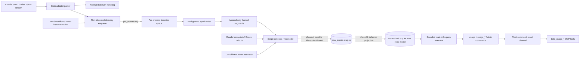

# Fine-grained metrics and token tracking

> **Status:** Phase 0.0 complete; ready for Phase 0 implementation
> **Created:** 2026-09-24
> **Phase 0.0 amendment:** 2026-09-25
> **Audited snapshot:** `origin/main` at `de81de3c4060363acdf8936c8ca24d66a006ba55` in worktree `worktrees/fine-grained-metrics-phase-0`
> **Scope:** ingestion, schema, local storage, Admin API, MCP tools, and JEV-router experimentation; no Web UI

## Executive decision

- Reject the claim that Bobi only receives plain text and must estimate all token usage. Both current brain adapters already receive provider-reported usage metadata.
- Preserve the provider's full usage dimensions. The current normalized `BrainCost` drops Claude cache-creation tokens as a separate dimension and drops Codex cache-write and reasoning-output tokens.
- Model a Bobi conversation turn separately from each internal LLM invocation and each tool execution. Turn-only metrics cannot identify agent-loop hotspots.
- Use a hybrid store: per-process append-only telemetry segments for ingestion, one out-of-band collector as the sole SQLite writer, and SQLite as the indexed query read model.
- Do not write SQLite directly from every agent process. WAL improves reader/writer concurrency but SQLite still has one writer; waiting on its lock violates the fail-safe, low-latency requirement.
- Keep provider facts and estimates separate. Unknown cached usage is `NULL`, not zero; provider-reported cost and calculated list-price cost are never added together.
- Keep `spend` backward-compatible and extend the existing `usage` Admin command and `bobi_usage_summary` MCP tool instead of creating duplicate summary surfaces. Add only the drill-down commands and tools that the current surface cannot represent.
- Treat "zero overhead" as an engineering target, not a literal property. The enforceable contract is: no database work, file I/O, lock wait, network wait, or `await` on the agent critical path; bounded non-blocking enqueue only; telemetry failures never fail a turn.
- Stage every valid event in `raw_events` before projection. Deferred, idempotent projection owns normalized foreign keys, so out-of-order producer spools cannot make ingestion fail.
- Run metrics queries on a dedicated bounded read-only executor. Metrics saturation must return `metrics_busy`; it must never delay lifecycle commands on the supervisor's ordered worker.

## Non-goals

- A metrics dashboard or other Web UI.
- Capturing prompt, response, or tool payload bodies by default.
- Treating estimated token counts as provider billing truth.
- Retrofitting a JEV router that does not yet exist in this repository.
- Sending per-step telemetry continuously to the hosted event server. The proposed Admin/MCP surface queries local state on demand.

## Part I: field validation - facts versus hypotheses

### Audit method and limitations

The audit used direct source reads, CodeGraph call-path queries, installed CLI help, retained local Claude and Codex JSONL files, and existing tests. No paid model request was made.

The meeting recording at `/Users/zodinet17/dev/recap.json` was used only to identify hypotheses. Its relevant claims were that Bobi currently has deployment-level metrics, SQLite might be appropriate, CLI use might leave only plaintext transcripts, fallback estimation might be acceptable, and JEV could act as a model classifier for A/B tests. None of those statements was treated as implementation truth.

The initial audit checkout was stale. Phase 0.0 refreshed the contract on `origin/main` at `de81de3`, which already includes the `usage` Admin command and `bobi_usage_summary` MCP tool. Implementation must rebase before each phase and rerun source and provider-contract checks if the base changes.

### Verdict table

| Hypothesis | Verdict | Evidence and consequence |
|---|---|---|
| CLI subprocesses expose only plaintext, so all tokens must be estimated | **Rejected** | Claude SDK messages expose `usage` and `model_usage`; Codex is already run with `--json` and Bobi consumes `turn.completed.usage`. Retained transcripts also contain provider usage. Estimation is a last fallback only. |
| Local SQLite is the best direct sink for every agent process | **Rejected as stated** | Bobi is multi-process and bursty. WAL still permits one writer. Direct writers either lose writes on lock errors or wait, adding tail latency. SQLite remains the best local query engine behind a single writer. |
| A normal user question/answer turn is sufficient granularity | **Rejected** | A turn can contain repeated model -> tool -> model cycles. The current source explicitly distinguishes the last assistant API call from the aggregate result of a multi-step turn. Hotspot attribution requires invocation and tool records. |
| Existing spend totals can seed complete historical metrics | **Rejected** | `SessionRegistry.record_cost()` has one production caller: persistent `Session._drain_turn()`. Workflow and supervised spawn paths use `bobi.brain.turns.drain_turn()` and do not persist `TurnResult.costs`. Existing aggregates are useful but not complete ground truth. |
| JEV routing fields can be wired to an existing router | **Rejected** | No JEV, router-decision, experiment, or variant integration exists in the audited tree. This RFC defines the future instrumentation contract. |

### Hypothesis 1: token metadata and transcript facts

#### Claude facts

- `bobi/brain/claude.py:187-212` translates SDK `AssistantMessage` objects and preserves `msg.usage` on `AssistantText`.
- `bobi/brain/claude.py:216-262` translates `ResultMessage`, including provider-reported `total_cost_usd`, `duration_ms`, `num_turns`, and per-model `model_usage`.
- The installed SDK's `AssistantMessage` has `usage`, `message_id`, `model`, `parent_tool_use_id`, and session fields. `ResultMessage` has `usage`, `model_usage`, cost, API duration, wall duration, and turn count.
- The installed Claude Code version was `2.1.267`. Its local help exposes `--print`, `--output-format json`, `--output-format stream-json`, `--include-partial-messages`, `--input-format stream-json`, `--resume`, and `--session-id`.
- The audited machine had 188 retained Claude JSONL files under `~/.claude/projects/**/<session-id>.jsonl`.
- An inspected Bobi transcript used this shape, with content removed:

```json
{
  "type": "assistant",
  "requestId": "...",
  "sessionId": "...",
  "timestamp": "...",
  "message": {
    "id": "...",
    "model": "...",
    "role": "assistant",
    "content": [{"type": "text|thinking|tool_use", "...": "..."}],
    "usage": {
      "input_tokens": 0,
      "output_tokens": 0,
      "cache_read_input_tokens": 0,
      "cache_creation_input_tokens": 0,
      "...": "provider additions"
    }
  }
}
```

- Usage is repeated on multiple JSONL lines for some single provider messages. In one retained sample, six usage-bearing rows represented four unique message IDs. `bobi/usage_backfill.py:119-180` already handles this correctly by deduplicating on message ID, falling back to request/row IDs.
- `bobi/chat_history.py:214-299` proves Claude transcripts also retain ordered `tool_use` and `tool_result` blocks. The current live Claude adapter discards those blocks as normalized events; it only yields assistant text and the terminal result.

Conclusion: Claude token collection can be exact online. Transcript parsing is a reconciliation and backfill mechanism, not the primary estimator.

#### Codex facts

- `bobi/brain/codex.py:44-57` configures `codex exec --json`; `bobi/brain/codex.py:100-145` parses its stdout as NDJSON.
- `bobi/brain/codex.py:252-264` starts a new or resumed non-interactive execution for each Bobi query.
- `bobi/brain/codex.py:280-304` consumes `thread.started`, assistant `item.completed`, and `turn.completed.usage`.
- The installed Codex CLI version was `0.156.1`. `codex exec --help` documents `--json` as JSONL event output and supports session resume.
- Official Codex non-interactive-mode documentation also describes JSONL event output: <https://learn.chatgpt.com/docs/non-interactive-mode.md>.
- Retained rollouts live at `$CODEX_HOME/sessions/YYYY/MM/DD/rollout-<timestamp>-<thread-id>.jsonl`, matching `bobi/chat_history.py:302-321`.
- The audited machine had 510 retained Codex rollout files. A large inspected rollout contained `task_started`, `task_complete`, `token_count`, and 7,863 function/custom-tool calls. Its usage event shape, with values removed, was:

```json
{
  "type": "event_msg",
  "ordinal": 123,
  "timestamp": "...",
  "payload": {
    "type": "token_count",
    "info": {
      "last_token_usage": {
        "input_tokens": 0,
        "cached_input_tokens": 0,
        "cache_write_input_tokens": 0,
        "output_tokens": 0,
        "reasoning_output_tokens": 0,
        "total_tokens": 0
      },
      "total_token_usage": {
        "input_tokens": 0,
        "cached_input_tokens": 0,
        "cache_write_input_tokens": 0,
        "output_tokens": 0,
        "reasoning_output_tokens": 0,
        "total_tokens": 0
      }
    }
  }
}
```

- `last_token_usage` may repeat in adjacent events; the inspected file had 9,375 populated token events, 6,562 unique `last_token_usage` objects, and monotonically non-decreasing `total_token_usage`. A parser must use event/turn boundaries and provider identifiers, not blindly sum every row.
- The persisted rollout format is richer than Bobi's current live adapter. `turn.completed.usage` gives an exact turn aggregate, while the rollout's `token_count`, task, and tool-call events can support finer reconstruction. Because this richer internal rollout shape is less stable than the documented stdout contract, it must be version-gated and retained as raw JSON for reprocessing.

Conclusion: Codex usage is also available without estimation. Exact turn totals are available on the current supported stream; finer invocation reconstruction should use guarded rollout reconciliation until the live stream contract is proven stable by fixtures.

#### Precision currently lost by Bobi

- `BrainCost` has only `input_tokens`, `cached_input_tokens`, and `output_tokens` (`bobi/brain/base.py:20-38`).
- Claude cache creation is folded into total input and is no longer separately queryable (`bobi/brain/claude.py:287-300`).
- Codex cache-write input and reasoning-output tokens are discarded (`bobi/brain/codex.py:75-83`).
- `SessionEntry.model_usage` is a session aggregate with the same limited dimensions (`bobi/sdk.py:267-297`). It cannot identify turns, invocations, tools, latency distributions, or routing variants.
- `total_cost_usd` is provider-reported for Claude, while Codex cost is estimated later from a static price table. `bobi/costs.py:94-145` correctly keeps reported and estimated dollars separate; the new design must preserve that rule.

#### Collection precedence and fallback

Use this precedence per usage measurement:

1. **Provider live event:** exact and lowest-latency. Deduplicate with provider message/turn/event ID.
2. **Provider transcript reconciliation:** exact where the retained transcript includes usage. It repairs missed queued events and process crashes.
3. **Provider-compatible local tokenizer:** estimate input/output out of band from the fullest serialized material available. Include system instructions and tool schemas where captured; query text alone is not enough.
4. **Model-family tokenizer or calibrated byte/character estimator:** final fallback for unknown/old models.

Rules:

- Never call a token-count API synchronously from the agent loop.
- Never infer cached tokens. If the provider did not report cache read/write, store `NULL`, not zero.
- Store `measurement_source`, `is_estimated`, `estimator_name`, `estimator_version`, and raw provider usage.
- Allow a later exact measurement to supersede an estimate without deleting the estimate or double-counting it.
- Treat tokenizer estimation of session input as lower confidence because hidden provider instructions, compaction, and cache boundaries may not be reconstructable from visible prose.

Fallback ownership is centralized in `bobi/metrics/estimate.py`; brain adapters emit facts and never choose estimators. The registry is keyed by provider, model family, estimator version, and supported tokenizer version. Codex may use a pinned local `tiktoken` encoding only where the model mapping is verified by fixtures. Claude has no assumed exact local tokenizer: use a versioned calibrated byte/character estimator unless a provider-supported counter can run out of band. Every estimator is optional, runs in the collector, and is benchmarked against exact retained usage before enablement. An unqualified estimator produces `NULL` rather than an unlabeled guess.

### Hypothesis 2: process and storage facts

#### Runtime topology

- The supervisor is a process that starts and watches the manager (`bobi/supervisor/__main__.py:75-132`, `bobi/supervisor/supervision.py:293-301`).
- Detached agents are separate process groups created with `start_new_session=True` (`bobi/subagent.py:905-913`).
- The Codex brain creates a new CLI subprocess for each turn (`bobi/brain/codex.py:100-145`, `:266-304`). Claude owns a persistent SDK/CLI transport per brain session.
- Therefore several persistent sessions, workflow agents, monitors, and per-turn CLI children can overlap and report metrics concurrently.
- Existing durable session state uses a companion-file `flock`, full-document read-modify-write, a uniquely named temporary file, and atomic rename (`bobi/sdk.py:330-434`, `bobi/fsutil.py:59-184`).
- `bobi/spend_governor.py:69-105` explicitly documents that invocation recorders race across processes and serializes the update with `file_lock`.
- Bobi already has a SQLite history index (`bobi/history.py`), but its index operation is a single synchronous batch writer and it does not configure WAL or a busy timeout (`bobi/history.py:328-367`). It is not evidence that many hot-path writers are safe.

#### Direct SQLite contention probe

A disposable local probe used eight processes, 500 autocommitted inserts each, and WAL:

| Configuration | Inserted | Lock errors | Worst observed insert |
|---|---:|---:|---:|
| `busy_timeout=0` | 238 / 4,000 | 3,762 | 0.534 ms among successes |
| `busy_timeout=5000` | 4,000 / 4,000 | 0 | 236.226 ms |

This is not a production benchmark. It demonstrates the expected SQLite property: WAL does not create multiple writers. Waiting avoids errors by moving the contention into tail latency. That is acceptable in the collector, not in an agent turn.

#### Storage comparison

| Option | Strengths | Risks | Verdict |
|---|---|---|---|
| A. Direct local SQLite from every process | Transactions, indexes, SQL aggregation, mature recovery, WAL readers | One writer; `database is locked` without waiting; tail stalls with waiting; migrations and DB faults enter every agent process | Do not use on the hot path |
| B. Append-only event log plus rollup worker | Producer isolation, replay, auditability, easy crash recovery, schema evolution through immutable events | Raw queries are slow; torn final record must be detected; requires collector lifecycle and retention | Best ingestion/source-of-truth layer |
| C. DuckDB or another analytical file store | Excellent scans and analytical SQL; good future export target | Not designed for many independent operational writers; weaker fit for small concurrent mutations and admin-serving lifecycle | Optional offline/warehouse sink, not primary ingestion |
| Recommended hybrid B + A | Non-blocking producers; one writer; indexed local queries; replayable recovery | More components and explicit lag/health monitoring | Adopt |

### Hypothesis 3: what a turn means

`bobi/session.py:890-896` already states that a single turn may be `model -> tool -> model -> ...`: the last assistant message represents one API call, while the terminal result is a turn aggregate. Therefore three levels must remain distinct:

- **Conversation turn:** one Bobi `query()` initiated by a human message, inbox event, initial agent task, or workflow prompt, ending at terminal result, deferral, or failure.
- **Workflow step:** one node in Bobi's workflow state machine. A non-LLM step may have no conversation turn; a prompt step can own a turn. Do not call every workflow step an LLM step.
- **LLM invocation:** one provider model inference inside the agentic loop. A conversation turn contains one or more invocations.
- **Tool execution:** one tool/MCP/shell call emitted by an invocation, with its own duration, result size, and status.

Tool attribution must not invent precision:

- Attribute the output/reasoning used to select a tool to the invocation that emitted the tool call.
- Attribute tool wall time to the tool execution itself.
- Record tool-result bytes and locally estimated result tokens as non-billing diagnostics.
- Link the next invocation to the tool result(s) it consumed. Its provider input usage is exact; the incremental contribution of one tool result is only exact when there is one unambiguous predecessor. Parallel/batched results use `attribution_method=shared_batch` and an explicit confidence value.
- Identify prompts by stable `prompt_template_id`, template version, and content hash. Do not store full prompt or tool bodies by default; the existing transcript-detail path remains the privileged debugging surface.

## Part II: proposed architecture

### Dataflow



### Producer contract

Add a provider-neutral telemetry envelope with:

- `event_id`: UUIDv7 or deterministic hash for replayed provider events.
- `schema_version`, `event_type`, `emitted_at_ns`, `producer_id`, and monotonic per-producer `sequence`.
- Correlation IDs: `session_id`, `turn_id`, `workflow_step_id`, `llm_invocation_id`, `tool_execution_id`, `router_decision_id`.
- Metadata-only payload. Text bodies are excluded by default; sizes, hashes, template IDs, model identifiers, and provider usage are allowed.

The agent path calls `put_nowait()` on a bounded in-process queue. It never opens SQLite, waits for a file lock, performs network I/O, or awaits collector work.

The background spool writer owns one segment per producer process. Every record uses this binary frame, with integers encoded as unsigned big-endian values:

```text
magic[4] = "BMT1"
schema_version[2]
payload_length[4]
payload_sha256[32]
payload[payload_length] = canonical UTF-8 JSON
terminator[1] = "\n"
```

The writer emits the complete frame with one append call. The collector rejects a wrong magic/version, impossible length, checksum mismatch, or missing terminator. A crash may leave one incomplete final frame; the collector imports every prior valid frame and leaves the cursor at the start of the incomplete frame. Per-process files prevent cross-process append interleaving and require no lock per event.

Suggested paths:

```text
<run-root>/state/metrics/
  spool/<producer-boot-id>/<segment>.telemetry
  archive/<date>/<segment>.telemetry.zst
  collector.state.json
  metrics.db
```

### Collector and SQLite

Exactly one logical collector writes `metrics.db`. In supervised deployments it belongs to the supervisor, which is independent of a wedged manager. Every collector, including the supervisor-owned one, takes the same single-winner lock so duplicate supervisors and standalone entry points converge safely.

Add this reusable non-blocking primitive to `bobi/fsutil.py`:

```python
@contextmanager
def try_file_lock(path: Path | str) -> Iterator[bool]:
    """Yield True while holding `<path>.lock`; yield False without waiting."""
```

It opens the same companion lock file as `file_lock`, calls `flock(LOCK_EX | LOCK_NB)`, yields `False` only for `EACCES`/`EAGAIN`, propagates other setup errors to the collector's fail-safe boundary, and always unlocks on a successful acquisition. It never deletes the lock file. A loser remains producer-only, reports `collector_role=standby`, and retries with jitter outside the agent turn. Lock acquisition is forbidden on the producer enqueue path.

Collector behavior is explicitly two phase:

1. **Stage:** tail producer segments, validate framing/schema/checksum, and insert complete events into `raw_events` with `INSERT OR IGNORE` by `event_id`. This transaction has no normalized foreign-key dependency. Advance the segment cursor only after this transaction commits.
2. **Project:** select staged events whose `projection_state` is `pending`, order dependency classes as session -> turn/workflow/router -> invocation -> tool/usage/cost/outcome, and project them with idempotent UPSERTs in short transactions. `DEFERRABLE INITIALLY DEFERRED` foreign keys permit parents and children in one transaction; parents missing from all selected events leave the child pending rather than failing ingestion.

Projection rules:

- Duplicate event IDs are successful no-ops and never duplicate normalized rows.
- A missing parent increments `projection_attempts`, records `missing_parent`, and retries with exponential backoff capped at 60 seconds.
- After 24 hours, the collector runs provider reconciliation for the affected session. If the parent is still unavailable, mark the row `quarantined`; keep its raw payload and expose it in health/coverage.
- Arrival or reconciliation of a matching parent automatically requeues quarantined dependents.
- Unexpected projector errors quarantine only the affected raw event; they do not roll back already staged events or stop the collector.
- Rebuild drops only normalized projections, resets projection state, and deterministically replays `raw_events`. Identical raw rows must reproduce identical normalized row counts and aggregate checksums.
- Use batches bounded by 500 events or 25 milliseconds, whichever occurs first.
- Archive imported segments rather than deleting the only replay source. The default raw-segment and `raw_events` retention is 30 days. The default metrics disk budget is `min(5 GiB, max(256 MiB, 5% of filesystem capacity))`, recalculated at collector startup. Reserve at least `max(1 GiB, 5% of filesystem capacity)` free for the rest of Bobi.
- Retention order is deterministic: delete expired compressed segments already represented in a verified SQLite backup; prune expired projected `raw_events`; compact normalized rows only after both are outside the same retention window. Under disk pressure, shorten the oldest covered history first, but never delete an active segment, an unimported frame, a pending/quarantined raw event, or the newest successful backup. Return the effective retention boundary and `retention_truncated=true` in coverage.
- Create a consistent SQLite backup at least daily and before pressure pruning. If no verified backup exists, stop archival deletion, report `retention_blocked`, and continue fail-safe ingestion until the reserve threshold is reached; at that point drop newly enqueued telemetry with an explicit counter rather than consuming Bobi's reserved disk.
- Reconcile provider transcripts after a turn/session closes and periodically for active sessions.
- Prefer exact provider measurements over estimates in query views, without overwriting either row.
- Publish collector health through the existing supervisor heartbeat: queue drops, spool bytes, import lag, last successful commit, rejected events, and reconciliation lag.

SQLite connection profile:

```sql
PRAGMA journal_mode = WAL;
PRAGMA synchronous = NORMAL;
PRAGMA foreign_keys = ON;
PRAGMA busy_timeout = 5000;
PRAGMA wal_autocheckpoint = 1000;
PRAGMA temp_store = MEMORY;
```

`synchronous=NORMAL` is the default because committed projections remain reconstructable from framed segments and `raw_events`. The spool writer calls `fdatasync` at least every 250 milliseconds or 64 KiB and on segment rotation. This bounds host-power-loss exposure without putting fsync on the producer path. Operators requiring stricter durability may select `metrics.durability=full`, which fsyncs every frame and uses SQLite `FULL`; the cost is collector/spool throughput, never agent-turn latency. Keep the database on a local filesystem; SQLite WAL is not the design for a network filesystem shared by multiple hosts.

### Codex support policy

- The documented `codex exec --json` `turn.completed.usage` contract is supported for exact turn totals on every Codex version in Bobi's tested release matrix.
- Invocation/tool reconstruction from persisted rollout internals is experimental and disabled unless `(codex_version, rollout_schema_fingerprint)` matches a checked-in parser contract.
- An unknown Codex version keeps exact turn totals, stores unrecognized raw events, reports `invocation_detail=unsupported_version`, and never guesses an invocation split.
- Promoting a rollout parser to supported requires redacted fixtures for new/resume/tool/error paths, exact deduplication tests, and the live S1/S2 smoke on that CLI version.

### Dedicated metrics query executor

`AdminListener` currently has one ordered dispatch worker. Lifecycle commands must remain responsive even when an analytical query scans the maximum retained range, so metrics reads never execute on that worker.

- The ordered worker validates the request, attempts a non-blocking capacity reservation, and hands accepted metrics queries to a dedicated executor.
- Defaults: 4 workers and 8 queued requests, configurable only downward/upward within documented safe bounds. The capacity reservation covers running plus queued work.
- Saturation publishes `status=error`, `result.code=metrics_busy`, and retry guidance within 50 milliseconds. It never waits for executor capacity.
- Each task opens its own SQLite URI connection with `mode=ro`, sets `PRAGMA query_only=ON`, and installs a progress handler enforcing a 1-second wall deadline.
- Query connections never issue checkpoints, migrations, writes, or `PRAGMA` changes that mutate persistent state.
- Result serialization is capped at 512 KiB after pagination; maximum page size is 200.
- Completion publishing occurs on the metrics worker. Lifecycle, status, and existing small reads continue on the ordered worker.
- Shutdown stops accepting work, cancels queued futures, and waits at most 2 seconds for running reads. A stuck query cannot block supervisor shutdown.
- Health reports active workers, queue depth, rejected queries, deadline cancellations, and p50/p95/p99 query latency.

### Failure isolation and performance contract

Literal zero overhead and guaranteed zero loss cannot both be true: recording an event consumes CPU, memory, and at least eventual I/O. The testable contract is:

- No synchronous disk/database/network operation in the LLM/tool execution path.
- Producer enqueue p99 target under 200 microseconds on supported hardware.
- Less than 1% change in end-to-end turn latency in controlled replay benchmarks.
- Bounded queue and memory. Queue overflow increments `telemetry_events_dropped`; it does not block.
- Spool/collector/schema/database errors are caught and rate-limited in logs; they never escape into an agent result.
- Normal process shutdown drains the local queue with a small bounded grace period outside the active turn.
- Abrupt-death gaps are reconciled from provider transcripts. Non-provider facts that were still only in memory at `SIGKILL` may remain missing; coverage counters make that visible.
- On SQLite corruption, stop writes, preserve the file for forensics, create a fresh read model, and replay archived segments. The agent remains operational throughout.

### Instrumentation scope

Implementation must cover all execution paths, not only persistent sessions:

- Persistent `Session._drain_turn()`.
- Shared `bobi.brain.turns.drain_turn()` used by workflow and supervised spawn execution.
- Brain adapters for provider invocation/tool events.
- Workflow step lifecycle.
- Admin-triggered chat and deferred human-input continuation.
- Router decision before model invocation.

Create one shared `record_turn_result()`/telemetry observer used by both drain implementations, with tests that enumerate every production drain caller. Continue dual-writing the legacy session aggregate during migration, then compare it with the new read model before switching `spend` reads.

## Part III: data model

### Principles

- Immutable raw events plus normalized query tables.
- Internal IDs are Bobi-generated and stable across provider retries.
- Provider session/message/turn/call IDs are separate columns.
- Token columns are nullable. Unknown is not zero.
- Every usage and cost measurement carries provenance and estimation state.
- Reported cost, estimated cost, and counterfactual experiment estimates remain separate.
- Prompt/tool content is excluded by default; store hashes, labels, byte sizes, and redaction status.

### Proposed SQLite schema

The following is the logical v1 DDL. Migration metadata and all timestamps use UTC Unix microseconds.

```sql
CREATE TABLE schema_meta (
    key TEXT PRIMARY KEY,
    value TEXT NOT NULL
);

CREATE TABLE raw_events (
    event_id TEXT PRIMARY KEY,
    schema_version INTEGER NOT NULL,
    event_type TEXT NOT NULL,
    producer_id TEXT NOT NULL,
    producer_sequence INTEGER NOT NULL,
    emitted_at_us INTEGER NOT NULL,
    received_at_us INTEGER NOT NULL,
    session_id TEXT,
    turn_id TEXT,
    invocation_id TEXT,
    source TEXT NOT NULL,
    payload_json TEXT NOT NULL,
    payload_sha256 TEXT NOT NULL,
    segment_path TEXT NOT NULL,
    segment_offset INTEGER NOT NULL,
    projection_state TEXT NOT NULL DEFAULT 'pending'
        CHECK (projection_state IN ('pending', 'projected', 'quarantined')),
    projection_attempts INTEGER NOT NULL DEFAULT 0,
    projection_not_before_us INTEGER,
    projected_at_us INTEGER,
    projection_error TEXT,
    UNIQUE (producer_id, producer_sequence),
    UNIQUE (segment_path, segment_offset)
);

CREATE TABLE spool_cursors (
    segment_path TEXT PRIMARY KEY,
    producer_id TEXT NOT NULL,
    committed_offset INTEGER NOT NULL CHECK (committed_offset >= 0),
    last_event_id TEXT,
    updated_at_us INTEGER NOT NULL
);

CREATE TABLE sessions (
    session_id TEXT PRIMARY KEY,
    session_name TEXT NOT NULL,
    provider_session_id TEXT,
    brain TEXT NOT NULL,
    provider TEXT NOT NULL,
    role TEXT,
    run_key TEXT,
    project TEXT,
    workflow_name TEXT,
    started_at_us INTEGER NOT NULL,
    ended_at_us INTEGER,
    status TEXT NOT NULL,
    terminal_error_kind TEXT,
    parent_session_id TEXT REFERENCES sessions(session_id) DEFERRABLE INITIALLY DEFERRED,
    metadata_json TEXT NOT NULL DEFAULT '{}'
);

CREATE TABLE turns (
    turn_id TEXT PRIMARY KEY,
    session_id TEXT NOT NULL REFERENCES sessions(session_id) DEFERRABLE INITIALLY DEFERRED,
    turn_index INTEGER NOT NULL,
    trigger_kind TEXT NOT NULL,
    trigger_id TEXT,
    is_user_initiated INTEGER NOT NULL CHECK (is_user_initiated IN (0, 1)),
    prompt_template_id TEXT,
    prompt_template_version TEXT,
    prompt_sha256 TEXT,
    prompt_bytes INTEGER,
    started_at_us INTEGER NOT NULL,
    first_output_at_us INTEGER,
    ended_at_us INTEGER,
    wall_duration_ms REAL,
    provider_duration_ms REAL,
    provider_api_duration_ms REAL,
    status TEXT NOT NULL,
    error_kind TEXT,
    provider_turn_id TEXT,
    UNIQUE (session_id, turn_index)
);

CREATE TABLE workflow_steps (
    workflow_step_id TEXT PRIMARY KEY,
    session_id TEXT NOT NULL REFERENCES sessions(session_id) DEFERRABLE INITIALLY DEFERRED,
    turn_id TEXT REFERENCES turns(turn_id) DEFERRABLE INITIALLY DEFERRED,
    run_key TEXT,
    workflow_name TEXT NOT NULL,
    step_name TEXT NOT NULL,
    step_index INTEGER,
    attempt INTEGER NOT NULL DEFAULT 1,
    step_type TEXT NOT NULL,
    started_at_us INTEGER NOT NULL,
    ended_at_us INTEGER,
    status TEXT NOT NULL,
    error_kind TEXT
);

CREATE TABLE router_decisions (
    router_decision_id TEXT PRIMARY KEY,
    turn_id TEXT NOT NULL REFERENCES turns(turn_id) DEFERRABLE INITIALLY DEFERRED,
    experiment_id TEXT,
    variant_id TEXT,
    assignment_unit TEXT,
    assignment_status TEXT NOT NULL DEFAULT 'assigned'
        CHECK (assignment_status IN ('assigned', 'unassigned')),
    assignment_key_hash TEXT,
    assignment_algorithm TEXT,
    cohort TEXT,
    router_name TEXT NOT NULL,
    router_version TEXT NOT NULL,
    policy_version TEXT,
    feature_schema_version TEXT,
    candidate_models_json TEXT NOT NULL,
    model_selected TEXT NOT NULL,
    control_model TEXT,
    router_score REAL,
    router_reason TEXT,
    router_latency_ms REAL NOT NULL,
    fallback_reason TEXT,
    decided_at_us INTEGER NOT NULL,
    metadata_json TEXT NOT NULL DEFAULT '{}'
);

CREATE TABLE llm_invocations (
    invocation_id TEXT PRIMARY KEY,
    turn_id TEXT NOT NULL REFERENCES turns(turn_id) DEFERRABLE INITIALLY DEFERRED,
    workflow_step_id TEXT REFERENCES workflow_steps(workflow_step_id) DEFERRABLE INITIALLY DEFERRED,
    router_decision_id TEXT REFERENCES router_decisions(router_decision_id) DEFERRABLE INITIALLY DEFERRED,
    parent_invocation_id TEXT REFERENCES llm_invocations(invocation_id) DEFERRABLE INITIALLY DEFERRED,
    invocation_index INTEGER NOT NULL,
    provider TEXT NOT NULL,
    model_requested TEXT,
    model_selected TEXT NOT NULL,
    provider_event_id TEXT,
    provider_request_id TEXT,
    started_at_us INTEGER NOT NULL,
    first_token_at_us INTEGER,
    ended_at_us INTEGER,
    wall_duration_ms REAL,
    provider_latency_ms REAL,
    time_to_first_token_ms REAL,
    status TEXT NOT NULL,
    stop_reason TEXT,
    error_kind TEXT,
    UNIQUE (turn_id, invocation_index)
);

CREATE TABLE tool_executions (
    tool_execution_id TEXT PRIMARY KEY,
    turn_id TEXT NOT NULL REFERENCES turns(turn_id) DEFERRABLE INITIALLY DEFERRED,
    triggering_invocation_id TEXT NOT NULL REFERENCES llm_invocations(invocation_id) DEFERRABLE INITIALLY DEFERRED,
    consuming_invocation_id TEXT REFERENCES llm_invocations(invocation_id) DEFERRABLE INITIALLY DEFERRED,
    provider_tool_call_id TEXT,
    tool_name TEXT NOT NULL,
    tool_kind TEXT NOT NULL,
    input_sha256 TEXT,
    input_bytes INTEGER,
    output_sha256 TEXT,
    output_bytes INTEGER,
    output_estimated_tokens INTEGER,
    started_at_us INTEGER NOT NULL,
    ended_at_us INTEGER,
    status TEXT NOT NULL,
    is_error INTEGER NOT NULL DEFAULT 0 CHECK (is_error IN (0, 1)),
    attribution_method TEXT NOT NULL DEFAULT 'unknown',
    attribution_confidence REAL,
    metadata_json TEXT NOT NULL DEFAULT '{}'
);

CREATE TABLE usage_measurements (
    measurement_id TEXT PRIMARY KEY,
    scope TEXT NOT NULL CHECK (scope IN ('turn', 'invocation')),
    turn_id TEXT NOT NULL REFERENCES turns(turn_id) DEFERRABLE INITIALLY DEFERRED,
    invocation_id TEXT REFERENCES llm_invocations(invocation_id) DEFERRABLE INITIALLY DEFERRED,
    provider TEXT NOT NULL,
    model TEXT NOT NULL,
    provider_event_id TEXT,
    measurement_source TEXT NOT NULL,
    is_estimated INTEGER NOT NULL CHECK (is_estimated IN (0, 1)),
    estimator_name TEXT,
    estimator_version TEXT,
    token_semantics_version INTEGER NOT NULL,
    input_tokens INTEGER,
    uncached_input_tokens INTEGER,
    cache_read_input_tokens INTEGER,
    cache_write_input_tokens INTEGER,
    cache_write_5m_input_tokens INTEGER,
    cache_write_1h_input_tokens INTEGER,
    cache_write_unknown_ttl_input_tokens INTEGER,
    cache_write_breakdown_complete INTEGER NOT NULL DEFAULT 0
        CHECK (cache_write_breakdown_complete IN (0, 1)),
    output_tokens INTEGER,
    reasoning_output_tokens INTEGER,
    observed_at_us INTEGER NOT NULL,
    raw_usage_json TEXT,
    supersedes_measurement_id TEXT REFERENCES usage_measurements(measurement_id) DEFERRABLE INITIALLY DEFERRED,
    CHECK (input_tokens IS NULL OR input_tokens >= 0),
    CHECK (uncached_input_tokens IS NULL OR uncached_input_tokens >= 0),
    CHECK (cache_read_input_tokens IS NULL OR cache_read_input_tokens >= 0),
    CHECK (cache_write_input_tokens IS NULL OR cache_write_input_tokens >= 0),
    CHECK (cache_write_5m_input_tokens IS NULL OR cache_write_5m_input_tokens >= 0),
    CHECK (cache_write_1h_input_tokens IS NULL OR cache_write_1h_input_tokens >= 0),
    CHECK (cache_write_unknown_ttl_input_tokens IS NULL OR cache_write_unknown_ttl_input_tokens >= 0),
    CHECK (output_tokens IS NULL OR output_tokens >= 0),
    CHECK (reasoning_output_tokens IS NULL OR reasoning_output_tokens >= 0),
    CHECK (
        cache_write_breakdown_complete = 0
        OR cache_write_input_tokens =
            COALESCE(cache_write_5m_input_tokens, 0)
            + COALESCE(cache_write_1h_input_tokens, 0)
            + COALESCE(cache_write_unknown_ttl_input_tokens, 0)
    ),
    CHECK (
        (scope = 'turn' AND invocation_id IS NULL)
        OR (scope = 'invocation' AND invocation_id IS NOT NULL)
    )
);

CREATE TABLE price_snapshots (
    price_snapshot_id TEXT PRIMARY KEY,
    provider TEXT NOT NULL,
    model TEXT NOT NULL,
    currency TEXT NOT NULL DEFAULT 'USD',
    effective_at_us INTEGER NOT NULL,
    input_per_million REAL,
    cache_read_per_million REAL,
    cache_write_per_million REAL,
    cache_write_5m_per_million REAL,
    cache_write_1h_per_million REAL,
    output_per_million REAL,
    source TEXT NOT NULL,
    source_version TEXT,
    raw_json TEXT NOT NULL
);

CREATE TABLE cost_measurements (
    cost_measurement_id TEXT PRIMARY KEY,
    scope TEXT NOT NULL CHECK (scope IN ('session', 'turn', 'invocation')),
    session_id TEXT REFERENCES sessions(session_id) DEFERRABLE INITIALLY DEFERRED,
    turn_id TEXT REFERENCES turns(turn_id) DEFERRABLE INITIALLY DEFERRED,
    invocation_id TEXT REFERENCES llm_invocations(invocation_id) DEFERRABLE INITIALLY DEFERRED,
    provider TEXT NOT NULL,
    model TEXT,
    amount_usd REAL NOT NULL CHECK (amount_usd >= 0),
    measurement_source TEXT NOT NULL,
    is_estimated INTEGER NOT NULL CHECK (is_estimated IN (0, 1)),
    price_snapshot_id TEXT REFERENCES price_snapshots(price_snapshot_id) DEFERRABLE INITIALLY DEFERRED,
    provider_event_id TEXT,
    observed_at_us INTEGER NOT NULL,
    raw_cost_json TEXT,
    CHECK (
        (scope = 'session' AND session_id IS NOT NULL
            AND turn_id IS NULL AND invocation_id IS NULL)
        OR (scope = 'turn' AND session_id IS NOT NULL
            AND turn_id IS NOT NULL AND invocation_id IS NULL)
        OR (scope = 'invocation' AND session_id IS NOT NULL
            AND turn_id IS NOT NULL AND invocation_id IS NOT NULL)
    )
);

CREATE TABLE experiment_outcomes (
    outcome_id TEXT PRIMARY KEY,
    router_decision_id TEXT NOT NULL REFERENCES router_decisions(router_decision_id) DEFERRABLE INITIALLY DEFERRED,
    outcome_name TEXT NOT NULL,
    outcome_value REAL,
    outcome_text TEXT,
    outcome_definition_version TEXT NOT NULL,
    outcome_source TEXT NOT NULL CHECK (outcome_source IN ('runtime', 'evaluator', 'human')),
    evaluator_name TEXT NOT NULL,
    evaluator_version TEXT NOT NULL,
    is_estimated INTEGER NOT NULL DEFAULT 0 CHECK (is_estimated IN (0, 1)),
    observed_at_us INTEGER NOT NULL,
    metadata_json TEXT NOT NULL DEFAULT '{}'
);

CREATE INDEX idx_sessions_provider_session ON sessions(provider, provider_session_id);
CREATE INDEX idx_sessions_started ON sessions(started_at_us);
CREATE INDEX idx_turns_session_started ON turns(session_id, started_at_us);
CREATE INDEX idx_turns_trigger ON turns(trigger_kind, trigger_id);
CREATE INDEX idx_steps_run ON workflow_steps(run_key, step_index, attempt);
CREATE INDEX idx_invocations_turn ON llm_invocations(turn_id, invocation_index);
CREATE INDEX idx_invocations_model_time ON llm_invocations(provider, model_selected, started_at_us);
CREATE INDEX idx_tools_turn ON tool_executions(turn_id, started_at_us);
CREATE INDEX idx_tools_name_time ON tool_executions(tool_name, started_at_us);
CREATE INDEX idx_usage_turn ON usage_measurements(turn_id, scope, is_estimated, observed_at_us);
CREATE INDEX idx_usage_invocation ON usage_measurements(invocation_id, is_estimated, observed_at_us);
CREATE INDEX idx_cost_turn ON cost_measurements(turn_id, scope, is_estimated);
CREATE INDEX idx_router_experiment ON router_decisions(experiment_id, variant_id, decided_at_us);
CREATE INDEX idx_raw_projection ON raw_events(projection_state, projection_not_before_us, received_at_us);

CREATE VIEW best_usage AS
WITH candidates AS (
    SELECT
        u.*,
        (u.input_tokens IS NOT NULL)
        + (u.uncached_input_tokens IS NOT NULL)
        + (u.cache_read_input_tokens IS NOT NULL)
        + (u.cache_write_input_tokens IS NOT NULL)
        + (u.cache_write_5m_input_tokens IS NOT NULL)
        + (u.cache_write_1h_input_tokens IS NOT NULL)
        + (u.cache_write_unknown_ttl_input_tokens IS NOT NULL)
        + (u.output_tokens IS NOT NULL)
        + (u.reasoning_output_tokens IS NOT NULL) AS completeness,
        CASE u.measurement_source
            WHEN 'provider_stream' THEN 50
            WHEN 'provider_reconciled' THEN 45
            WHEN 'claude_transcript' THEN 40
            WHEN 'codex_rollout' THEN 40
            WHEN 'local_tokenizer' THEN 20
            WHEN 'calibrated_estimator' THEN 10
            ELSE 0
        END AS source_priority
    FROM usage_measurements AS u
    WHERE NOT EXISTS (
        SELECT 1
        FROM usage_measurements AS newer
        WHERE newer.supersedes_measurement_id = u.measurement_id
    )
), ranked AS (
    SELECT
        candidates.*,
        ROW_NUMBER() OVER (
            PARTITION BY
                scope,
                turn_id,
                COALESCE(invocation_id, ''),
                provider,
                model
            ORDER BY
                is_estimated ASC,
                completeness DESC,
                source_priority DESC,
                token_semantics_version DESC,
                observed_at_us DESC,
                measurement_id DESC
        ) AS usage_rank
    FROM candidates
)
SELECT
    measurement_id,
    scope,
    turn_id,
    invocation_id,
    provider,
    model,
    provider_event_id,
    measurement_source,
    is_estimated,
    estimator_name,
    estimator_version,
    token_semantics_version,
    input_tokens,
    uncached_input_tokens,
    cache_read_input_tokens,
    cache_write_input_tokens,
    cache_write_5m_input_tokens,
    cache_write_1h_input_tokens,
    cache_write_unknown_ttl_input_tokens,
    cache_write_breakdown_complete,
    output_tokens,
    reasoning_output_tokens,
    observed_at_us,
    raw_usage_json,
    supersedes_measurement_id
FROM ranked
WHERE usage_rank = 1;
```

### Query semantics

- `best_usage` is the executable view above. It selects one whole measurement per scope/target/provider/model; it never fills a missing exact dimension from an estimate and never includes a superseded row.
- `input_tokens` is normalized total model input. `uncached_input_tokens`, cache read, and cache write are non-overlapping where provider semantics permit. `raw_usage_json` preserves the provider's original counters when semantics differ.
- Anthropic cache creation preserves `ephemeral_5m_input_tokens` and `ephemeral_1h_input_tokens` separately. Codex or older records with cache writes but no TTL put the count in `cache_write_unknown_ttl_input_tokens`; the implementation never guesses a TTL. Cost estimation remains unknown when TTL-specific pricing is required but TTL is unknown.
- `reasoning_output_tokens` is a subset of `output_tokens` for current Codex data and must not be added again.
- Aggregates choose exactly one granularity: invocation rows when every invocation in the turn has a selected measurement, otherwise the exact turn row. They never sum a turn aggregate with its child invocation rows. Coverage states which granularity was used.
- `reported_cost_usd` and `estimated_cost_usd` are separate response fields. Cost queries choose one compatible scope and never sum a session/turn aggregate with its child invocation rows. A provider-reported turn total must not be distributed across invocations or models unless the provider gives that split.
- Coverage is always returned with aggregates: exact invocation count, estimated invocation count, unknown invocation count, dropped events, and reconciled events.

### JEV experiment contract

Record routing before invoking the model. The v1 assignment unit is one stable work item: `run_key` for a workflow/monitor run, otherwise the Bobi `session_id`. A caller may supply an explicit stable `experiment_subject` when neither identifier represents the desired cohort. If none is available, do not enroll the turn; record `assignment_status=unassigned` and the reason.

Assignment is deterministic and versioned:

```text
digest = HMAC-SHA256(deployment_assignment_secret,
                     experiment_id + "\0" + assignment_unit + "\0" + assignment_key)
bucket = uint64_be(digest[0:8]) / 2^64
variant = first cumulative configured weight greater than bucket
algorithm = "hmac-sha256-u64-v1"
```

Persist `assignment_key_hash=HMAC-SHA256(secret, assignment_key)`, never the source key. The deployment secret is runtime-only and must remain stable for the lifetime of an experiment. Checked-in golden vectors use a public test secret. Analysis uses intent-to-treat by `variant_id`; a fallback remains in its assigned variant and records `fallback_reason`.

Required dimensions:

- Experiment: `experiment_id`, `variant_id`, `assignment_key_hash`, `cohort`.
- Router: `router_name`, `router_version`, `router_decision_id`, `policy_version`, `feature_schema_version`, `router_latency_ms`.
- Choice: candidate models, `model_selected`, `control_model`, score, reason, fallback.
- Outcomes: completion/error, turn/run latency, exact/estimated cost, tokens, retries, human escalation, and separately versioned quality/evaluator scores.

Operational outcomes are authoritative only when emitted by Bobi's runtime projection from durable run/turn state. Quality outcomes are authoritative only when submitted by a named external evaluator or an identified human assessment; the router and model under test never grade themselves. Quality rows require `outcome_definition_version`, `outcome_source`, `evaluator_name`, and `evaluator_version`, and experiment queries never combine different definition/evaluator versions into one statistic.

Do not calculate a fictional per-turn ROI by applying the control model's price to the treatment model's tokens. Model choice changes output length, tool behavior, retries, and success rate. ROI should compare randomized cohorts over completed work, with confidence intervals and coverage rates.

## Part IV: Admin API and MCP tools

### Admin protocol decision

Keep `spend` unchanged for compatibility. During migration it continues reading legacy state; after parity is proven it may source its existing aggregate fields from the metrics read model without changing the payload. Preserve the current `usage` Admin command and `bobi_usage_summary` MCP tool; they are the summary surfaces and must be widened additively instead of duplicated.

Add only these drill-down commands to both allowlists:

- `usage_session`
- `usage_turn`
- `usage_hotspots`
- `usage_experiment`

The allowlist exists in both `bobi/supervisor/admin.py:55-61` and `event-server/worker/src/fleet.ts:350-368`; `tests/test_admin_command_parity.py` must remain the gate. Document the additions in `docs/ADMIN_PROTOCOL.md` and increment `SUPERVISOR_VERSION` so mixed-version fleets can report unsupported commands clearly.

The Phase 3 operator client exposes friendly aliases without adding wire verbs:

| CLI command | Admin wire command |
|---|---|
| `bobi admin metrics_summary` | `usage` |
| `bobi admin metrics_session` | `usage_session` |
| `bobi admin metrics_turn` | `usage_turn` |
| `bobi admin metrics_hotspots` | `usage_hotspots` |
| `bobi admin metrics_experiment` | `usage_experiment` |

All list commands are cursor-paginated and response-capped because one reply is carried in one bus message and one KV command result. Recommended defaults: `limit=50`, maximum `200`, maximum time range `31d` unless a session/turn ID narrows the query.

### Command contracts

#### `usage` (existing, additively widened)

Request:

```json
{
  "from": "2026-09-01T00:00:00Z",
  "to": "2026-10-01T00:00:00Z",
  "group_by": ["model", "experiment_id", "variant_id"],
  "session_id": null,
  "run_key": null,
  "model": null,
  "experiment_id": null,
  "variant_id": null
}
```

`window_seconds` plus optional `end_at` remains the legacy form. `from`/`to` is the additive explicit-range form; a request must use one form, not both. The existing MCP `days` argument continues mapping to `window_seconds`. New MCP filters are optional, so older clients remain valid.

Response separates reported and estimated cost and includes coverage:

```json
{
  "usage": {
    "window": {},
    "jobs": {},
    "tokens": {},
    "cost_usd": 0.0,
    "estimated_cost_usd": 0.0,
    "metrics_schema_version": 1,
    "totals": {
      "input_tokens": 0,
      "cache_read_input_tokens": 0,
      "cache_write_input_tokens": 0,
      "cache_write_5m_input_tokens": 0,
      "cache_write_1h_input_tokens": 0,
      "cache_write_unknown_ttl_input_tokens": 0,
      "output_tokens": 0,
      "reasoning_output_tokens": 0,
      "reported_cost_usd": 0.0,
      "estimated_cost_usd": 0.0,
      "turns": 0,
      "invocations": 0,
      "tool_executions": 0
    },
    "groups": [],
    "coverage": {
      "exact_invocations": 0,
      "estimated_invocations": 0,
      "unknown_invocations": 0,
      "events_dropped": 0,
      "collector_lag_ms": 0,
      "retained_from": null,
      "retained_to": null
    }
  }
}
```

The existing `window`, `jobs`, `tokens.input`, `tokens.cached_input`, `tokens.output`, `tokens.total`, `cost_usd`, and `estimated_cost_usd` meanings and types do not change. New filters and fields are additive. Old supervisors may return only the legacy fields; callers must use supervisor capability/version data rather than treating absent fine-grained fields as zero.

#### `usage_session`

Arguments: `session_id` required; optional `cursor`, `limit`, `include_turns=true`. Returns `{"usage_session": {"session": ..., "turns": ..., "next_cursor": ..., "coverage": ...}}`. It does not return transcript bodies.

#### `usage_turn`

Arguments: `turn_id` required. Returns `{"usage_turn": {"turn": ..., "invocations": ..., "tool_executions": ..., "usage_measurements": ..., "cost_measurements": ..., "workflow_step": ..., "router_decision": ..., "coverage": ...}}`. Tool arguments/results remain hashes and sizes unless the caller separately uses the existing transcript-detail command.

#### `usage_hotspots`

Arguments:

```json
{
  "from": "...",
  "to": "...",
  "scope": "session|turn|invocation|tool|prompt_template",
  "metric": "reported_cost|estimated_cost|input_tokens|output_tokens|latency|tool_result_bytes",
  "session": null,
  "top_n": 20
}
```

The response is `{"usage_hotspots": {"hotspots": [...], "next_cursor": ..., "coverage": ...}}` and includes rank, IDs/labels, value, measurement provenance, and coverage. Tool-token attribution includes `attribution_method` and confidence.

#### `usage_experiment`

Arguments: `experiment_id` required; optional time range, cohort, outcome, `outcome_definition_version`, and evaluator filters. Returns `{"usage_experiment": {"experiment_id": ..., "variants": ..., "coverage": ...}}` with per-variant sample size, completion/error rates, latency, reported/estimated cost, tokens, fallback rate, and quality outcome. It must not claim statistical significance unless the implementation actually computes and labels the method.

### Errors

Use machine-readable errors consistent with the existing admin protocol:

- `metrics_not_ready`: collector/database is unavailable; includes retry guidance and last healthy time.
- `metrics_busy`: the bounded query executor is saturated; returned within 50 milliseconds with retry guidance.
- `unknown_session` / `unknown_turn` / `unknown_experiment`.
- `invalid_range`: inverted or over-limit time range.
- `invalid_cursor`: cursor does not match the filter set or retention window.
- `query_too_large`: caller must narrow filters or page.

### MCP tools

Register logically read-only query tools in `event-server/worker/src/mcp.ts`, all using the existing `issueAdminCommand` plus poll path:

- Existing `bobi_usage_summary`, widened additively and still aggregating per-instance `usage` results across the selected fleet.
- `bobi_usage_session` -> `usage_session`.
- `bobi_usage_turn` -> `usage_turn`.
- `bobi_usage_hotspots` -> `usage_hotspots`.
- `bobi_usage_experiment` -> `usage_experiment`.

Each tool validates arguments with Zod and returns a pending `command_id` when the supervisor does not answer within the short MCP wait budget. Follow the existing transcript-tool convention: set `readOnlyHint: false` because issuing the admin command writes an audit/command record even though the deployment query itself does not mutate metrics; set `destructiveHint: false` and `idempotentHint: true`. `bobi_command_result` remains the generic poll mechanism.

Security and privacy:

- Reuse the operator-token and bubble-scoped admin boundary documented in `docs/ADMIN_PROTOCOL.md`.
- Do not put full prompts, model outputs, tool inputs, secrets, paths, or environment variables into metrics.
- Hash assignment keys with a deployment-specific salt.
- Apply local retention to raw segments and normalized rows; return retention/coverage boundaries to callers.

## Part V: implementation roadmap and testing

### Phase 0.0 - close the implementation contract

- Freeze B1-B8 as executable decisions: isolated query execution, two-phase projection, framed spools, TTL-qualified cache writes, non-blocking collector election, existing usage-surface reuse, resolved operating policies, and executable usage selection SQL.
- Verify the RFC against current `origin/main`; do not change application code in this phase.
- Produce a tracker-ready issue whose scope, phases, SLOs, exclusions, and live gates point back to this RFC as the technical source of truth.

Verification:

```bash
git diff --check
pytest tests/test_plan_artifact_check.py -q --timeout=30
stale_mcp_prefix='bobi_'
! rg -n "${stale_mcp_prefix}metrics_|^#### .*metrics_(summary|session|turn|hotspots|experiment)|^- .*metrics_(summary|session|turn|hotspots|experiment)" \
  plans/2026-09-24-fine-grained-metrics-token-tracking.md
```

Definition of done: the plan check passes; the stale-contract search has no matches except documented CLI alias examples; all B1-B8 decisions are testable; the Linear-ready issue contains no transient research-source references; and the phase ends in a documentation-only local commit.

### Phase 0 - spike and freeze contracts

- Refresh from current `origin/main` in a clean task worktree.
- Check in redacted Claude SDK, Claude transcript, Codex stdout, and Codex rollout fixtures from supported CLI versions.
- Define provider event IDs, deduplication rules, token semantics, and exact-versus-estimated precedence.
- Extend `BrainCost` or replace it with a lossless usage type carrying cache write, reasoning output, raw usage, and provenance.
- Prototype the framed spool, single collector, schema migration, and SQLite rebuild.
- Benchmark producer enqueue, segment throughput, collector lag, and direct-SQLite contention. Exit only when the no-blocking critical-path contract is demonstrated.
- Run the Phase 0 live provider probe against every provider supported by the release. Fixture parity alone cannot close this phase.

Verification tooling:

```bash
pytest tests/metrics/test_provider_contracts.py \
       tests/metrics/test_spool.py \
       tests/metrics/test_store.py \
       tests/metrics/test_projection.py -q --timeout=30
.venv/bin/python scripts/benchmark_metrics.py producer --events 1000000 --processes 1,8,32,64
.venv/bin/python scripts/benchmark_metrics.py collector --burst-multiple 10 --assert-drain-seconds 60
.venv/bin/python scripts/live_metrics_smoke.py provider-probe --provider claude --db "$BOBI_SMOKE_ROOT/phase0-claude/metrics.db"
.venv/bin/python scripts/live_metrics_smoke.py provider-probe --provider codex --db "$BOBI_SMOKE_ROOT/phase0-codex/metrics.db"
```

Transition gates: 100% parity for every provider-reported token dimension; zero duplicate logical measurements after replay; enqueue p99 at or below 200 microseconds; collector sustained throughput at least 10x measured production peak; a 10x peak backlog drains within 60 seconds; deterministic rebuild row counts and aggregate checksums match exactly; and both live provider probes pass with `is_estimated=0`.

Definition of done: checked-in redacted provider fixtures and version matrix; executable schema/migrations and prototype modules; benchmark JSON containing host/CLI metadata and percentiles; SQLite contention and rebuild reports; and live S1 artifacts for Claude and Codex on the same commit.

### Phase 1 - core ingestion

- Add the metrics event/enqueue/spool modules and collector lifecycle.
- Instrument persistent sessions, shared workflow/subagent drains, workflow steps, and provider adapters.
- Capture Claude invocation/tool IDs live; capture Codex turn aggregate live and richer invocation/tool detail where the supported stream exposes it.
- Preserve the current legacy `state.json` cost writer for compatibility.
- Add health counters and bounded shutdown drain.
- Ship disabled by default or in shadow mode first; compare new session totals with legacy totals and provider transcripts.
- Run real single-turn and multi-step tool-loop smoke tests through installed Bobi agents on every supported provider.

Verification tooling:

```bash
pytest tests/metrics/test_producer.py \
       tests/metrics/test_collector.py \
       tests/metrics/test_execution_paths.py \
       tests/test_session.py tests/test_workflow.py -q --timeout=30
.venv/bin/python scripts/benchmark_metrics.py turn-replay --compare telemetry-off,shadow,full
.venv/bin/python scripts/live_metrics_smoke.py installed-matrix --checks single-turn,tool-loop
```

Transition gates: enqueue p99 remains at or below 200 microseconds; deterministic turn replay latency regression is below 1%; no producer performs SQLite I/O or waits on a lock; zero agent-turn failures across injected queue/spool/database errors; no telemetry drops at measured production peak; and every enumerated production turn path emits one conversation turn plus its invocation/tool children. Live S1 and S2 pass for Claude and Codex.

Definition of done: shadow-mode ingestion is wired to every production drain path; legacy writes remain enabled; collector health is visible; fault-injection and execution-path coverage pass; and live artifacts contain turn IDs, exact token rows, tool timings, attribution labels, and collector health.

### Phase 2 - reconciliation and estimation

- Add incremental Claude transcript reconciliation using message-ID dedupe.
- Add version-gated Codex rollout reconciliation using turn/task/token boundaries; never sum repeated `token_count` rows blindly.
- Add local tokenizer adapters and calibrated fallback estimation.
- Add repair/rebuild commands and retention/archival.
- Define the cutover criterion: no unexplained exact-total divergence across supported brains and all execution paths for a representative soak period.
- Run the `SIGKILL` recovery smoke and prove an exact transcript/rollout measurement repairs the interrupted turn.

Verification tooling:

```bash
pytest tests/metrics/test_reconcile.py \
       tests/metrics/test_estimate.py \
       tests/metrics/test_retention.py \
       tests/metrics/test_rebuild.py -q --timeout=30
.venv/bin/python scripts/metrics_soak.py --hours 72 --kill-workers --replay --json-out "$BOBI_SMOKE_ROOT/soak.json"
.venv/bin/python scripts/live_metrics_smoke.py installed-matrix --checks single-turn,tool-loop,process-kill
```

Transition gates: exact transcript/rollout parity is 100% for reported dimensions; duplicate logical measurements remain zero after repeated reconciliation; an exact row supersedes an estimate without deleting it; `SIGKILL` recovery converges within 60 seconds after explicit reconciliation; the 72-hour soak has zero unexplained exact-total divergence, zero database corruption, and zero agent failures caused by telemetry; rebuild checksums match; and any estimator enabled for a model family has held-out MAPE at or below 10% and p95 absolute percentage error at or below 20% over at least 100 exact turns. Estimators that miss the gate remain disabled for that model family.

Definition of done: supported provider/parser matrix, estimator calibration report, retention-pressure report, repair/rebuild commands, 72-hour soak artifact, and live S4 evidence for both providers.

### Phase 3 - Admin API and MCP

- Add the four `usage_*` drill-down Admin commands, additively widen `usage`, update protocol docs/version gates, and preserve allowlist parity, pagination, and response caps.
- Add the four drill-down MCP tools, widen `bobi_usage_summary`, and add TypeScript tests for schema validation, pending polling, unsupported supervisor versions, and bounded results.
- Move the existing `spend` read to the new source only after dual-read parity; keep its wire shape unchanged.
- Add the operator smoke client `bobi admin <metrics_command>`; the current repository has no `bobi admin` command, so Phase 3 cannot claim this gate before that client exists.
- Run the real Admin REST path and the real `/mcp` transport against a live supervisor and Worker, not an in-process mock.

Verification tooling:

```bash
pytest tests/test_supervisor_admin.py tests/test_admin_command_parity.py tests/metrics/test_query.py -q --timeout=30
cd event-server && npm test -- --run worker/src/mcp.test.ts worker/src/fleet.test.ts
.venv/bin/python scripts/benchmark_metrics.py queries --dataset tests/fixtures/metrics/representative.db --saturate
.venv/bin/python scripts/live_metrics_smoke.py installed-matrix --checks single-turn,tool-loop,process-kill,admin,mcp
```

Transition gates: turn detail p95 is at or below 100 milliseconds, summary p95 at or below 250 milliseconds, and hotspot p95 at or below 500 milliseconds on the representative retained dataset; an accepted query completes or hits its one-second deadline; saturation returns `metrics_busy` within 50 milliseconds; lifecycle/status commands remain below 100 milliseconds p99 while the metrics executor is saturated; responses never exceed 512 KiB or 200 rows; and Python/TypeScript allowlists have exact parity.

Definition of done: versioned Admin protocol; existing `usage` and `bobi_usage_summary` remain backward-compatible; all four drill-down commands/tools work through the real Worker; query benchmark JSON and saturation proof are attached; and live S3 returns matching Admin/MCP data.

### Phase 4 - JEV router experiments

- Introduce the router interface and emit `router_decision` before invocation.
- Implement deterministic experiment assignment and immutable policy/feature versions.
- Record fallbacks and outcomes separately.
- Add experiment aggregation and guard against sample-ratio mismatch, missing outcomes, and exact/estimated coverage imbalance between variants.
- Rerun the full live smoke matrix under both control and treatment assignments and prove the routing record precedes the model invocation.

Verification tooling:

```bash
pytest tests/metrics/test_router_assignment.py \
       tests/metrics/test_experiment_queries.py \
       tests/metrics/test_quality_outcomes.py -q --timeout=30
.venv/bin/python scripts/benchmark_metrics.py router --samples 100000
.venv/bin/python scripts/check_srm.py --expected 50,50 --observed 5500,4500 --max-p-value 0.001
.venv/bin/python scripts/live_metrics_smoke.py experiment-matrix \
  --assignment-vectors tests/fixtures/metrics/jev-live-smoke-vectors.json \
  --checks single-turn,tool-loop,process-kill,admin,mcp
```

Transition gates: deterministic assignment is identical across processes and restarts for 100% of golden vectors; every enrolled router decision commits before its first model invocation; router latency is at or below 50 milliseconds p95 and 100 milliseconds p99; the SRM detector flags a 55/45 split at 10,000 samples with `p < 0.001`; fallback rows remain in their intent-to-treat variant; and experiment aggregation never mixes outcome-definition/evaluator versions or hides exact/estimated coverage imbalance.

Definition of done: immutable experiment configuration and golden vectors; routing and outcome schema migrations; router benchmark and SRM proof; reproducible per-variant report; and S1-S4 pass for both control and treatment assignments on both providers.

### Mandatory live smoke test gates

Unit tests, replay fixtures, and deterministic benchmarks remain required, but they are insufficient for phase sign-off. The live checks below are blocking release gates. A skipped provider, unavailable credential, unavailable Worker, or missing CLI surface is `NOT VERIFIED`, not a pass.

Run each smoke test in a disposable `BOBI_HOME`; never use a production agent, transcript, operator token, or metrics database. Keep command output and sanitized query results as CI/release artifacts. Do not retain prompt bodies, tool arguments, credentials, or raw transcripts in the artifact bundle.

#### Shared smoke harness and setup

Phase 0 must add `scripts/live_metrics_smoke.py`. It provisions two minimal installed smoke agents, waits for collector convergence without arbitrary sleeps, locates the exact provider transcript/rollout for a turn, and exits non-zero on parity or coverage failure. The installed smoke team exposes deterministic local `view_file`, `edit_file`, and `block_for_seconds` tools so both providers execute the same tool contract. The helper must use the production brain adapters, provider transcript parsers, and storage code rather than a second implementation.

```bash
export BOBI_SMOKE_ROOT="$(mktemp -d "${TMPDIR:-/tmp}/bobi-metrics-smoke.XXXXXX")"
export BOBI_HOME="$BOBI_SMOKE_ROOT/home"
export BOBI_CLAUDE_AGENT="metrics-smoke-claude"
export BOBI_CODEX_AGENT="metrics-smoke-codex"
export BOBI_METRICS_FAULT_INJECTION=1

.venv/bin/python scripts/live_metrics_smoke.py provision \
  --bobi-home "$BOBI_HOME" \
  --claude-agent "$BOBI_CLAUDE_AGENT" \
  --codex-agent "$BOBI_CODEX_AGENT"
```

Expected output:

```text
READY agent=metrics-smoke-claude provider=claude
READY agent=metrics-smoke-codex provider=codex
```

The helper must fail before spending tokens if provider authentication, the expected CLI version, the agent installation, or the isolated metrics directory is unavailable. Production startup must reject `BOBI_METRICS_FAULT_INJECTION=1` unless the runtime was provisioned by this disposable smoke harness; merely setting the environment variable against a normal installation must not enable faults.

#### Smoke S1 - live provider single turn and exact token parity

Phase 0 runs the production adapters directly and writes the result through the prototype collector. Run both commands; supporting only one provider is not enough when both Claude and Codex are in release scope.

```bash
.venv/bin/python scripts/live_metrics_smoke.py provider-probe \
  --provider claude \
  --prompt "Reply with exactly METRICS_SMOKE_OK." \
  --db "$BOBI_SMOKE_ROOT/phase0-claude/metrics.db"

.venv/bin/python scripts/live_metrics_smoke.py provider-probe \
  --provider codex \
  --prompt "Reply with exactly METRICS_SMOKE_OK." \
  --db "$BOBI_SMOKE_ROOT/phase0-codex/metrics.db"

for METRICS_DB in \
  "$BOBI_SMOKE_ROOT/phase0-claude/metrics.db" \
  "$BOBI_SMOKE_ROOT/phase0-codex/metrics.db"; do
  sqlite3 -header -column "$METRICS_DB" \
    "SELECT provider,
            measurement_source,
            is_estimated,
            input_tokens,
            cache_read_input_tokens,
            cache_write_input_tokens,
            output_tokens,
            reasoning_output_tokens
       FROM best_usage
      ORDER BY observed_at_us DESC
      LIMIT 1;"
done
```

Expected output from each command:

```text
PASS provider=<claude|codex> response=METRICS_SMOKE_OK wall_latency_ms=<positive> is_estimated=0 parity=exact
```

From Phase 1 onward, repeat the check through installed Bobi agents. Select one agent, then repeat the block with the other provider:

```bash
export SMOKE_PROVIDER="claude"
export SMOKE_AGENT="$BOBI_CLAUDE_AGENT"
export METRICS_DB="$BOBI_HOME/agents/$SMOKE_AGENT/run/state/metrics/metrics.db"

bobi agent "$SMOKE_AGENT" start --fresh
bobi agent "$SMOKE_AGENT" message --wait --timeout 300 \
  "Reply with exactly METRICS_SMOKE_OK."

export TURN_ID="$(.venv/bin/python scripts/live_metrics_smoke.py wait-latest-turn \
  --db "$METRICS_DB" --provider "$SMOKE_PROVIDER" --timeout 30)"

sqlite3 -header -column "$METRICS_DB" \
  "SELECT t.turn_id,
          ROUND(t.wall_duration_ms, 3) AS wall_ms,
          ROUND(t.provider_duration_ms, 3) AS provider_ms,
          u.model,
          u.measurement_source,
          u.is_estimated,
          u.input_tokens,
          u.cache_read_input_tokens,
          u.cache_write_input_tokens,
          u.output_tokens,
          u.reasoning_output_tokens
     FROM turns AS t
     JOIN best_usage AS u ON u.turn_id = t.turn_id
    WHERE t.turn_id = '$TURN_ID'
    ORDER BY u.model;"

.venv/bin/python scripts/live_metrics_smoke.py verify-token-parity \
  --agent "$SMOKE_AGENT" \
  --provider "$SMOKE_PROVIDER" \
  --turn-id "$TURN_ID" \
  --db "$METRICS_DB"
```

Expected SQLite properties:

```text
turn_id=<non-empty>  wall_ms>0  measurement_source=provider_stream  is_estimated=0
input_tokens>=0     output_tokens>0
```

Cache columns may be `NULL` only when the provider did not report that dimension. They must never be synthesized as zero. Expected verifier output:

```text
PASS provider=<claude|codex> turn_id=<id> is_estimated=0 parity=exact
```

`verify-token-parity` must independently parse the retained Claude transcript or Codex rollout, deduplicate according to the frozen provider contract, and compare every reported dimension against `best_usage`. Comparing normalized columns only with `raw_usage_json` from the same database row is not an independent parity check.

#### Smoke S2 - real multi-step tool calling

Run for both provider-backed smoke agents. The prompt must cause `view_file`, `edit_file`, and a second `view_file` call; a text-only answer or substitution with a shell command fails the smoke.

```bash
export SMOKE_FILE="$BOBI_HOME/agents/$SMOKE_AGENT/run/workspace/LIVE_SMOKE.txt"
printf 'state=before\n' > "$SMOKE_FILE"

bobi agent "$SMOKE_AGENT" message --wait --timeout 300 \
  "Call view_file on LIVE_SMOKE.txt. Call edit_file to change state=before to state=after. Call view_file again to verify it, then reply with exactly TOOL_SMOKE_OK."

export TOOL_TURN_ID="$(.venv/bin/python scripts/live_metrics_smoke.py wait-latest-turn \
  --db "$METRICS_DB" --provider "$SMOKE_PROVIDER" --timeout 30)"

sqlite3 -header -column "$METRICS_DB" \
  "SELECT te.tool_name,
          te.tool_kind,
          ROUND((te.ended_at_us - te.started_at_us) / 1000.0, 3) AS duration_ms,
          te.output_estimated_tokens AS result_token_contribution,
          te.attribution_method,
          te.attribution_confidence,
          te.status,
          te.triggering_invocation_id,
          te.consuming_invocation_id
     FROM tool_executions AS te
    WHERE te.turn_id = '$TOOL_TURN_ID'
    ORDER BY te.started_at_us;"

.venv/bin/python scripts/live_metrics_smoke.py verify-tools \
  --db "$METRICS_DB" \
  --turn-id "$TOOL_TURN_ID" \
  --required-tools view_file,edit_file,view_file \
  --required-kinds file_read,file_edit \
  --minimum-tool-count 3
```

Expected output includes provider-specific raw tool names but normalized kinds equivalent to:

```text
tool_name  tool_kind  duration_ms  result_token_contribution  attribution_method  status
view_file  file_read  >=0          >=0                        <not-empty>          completed
edit_file  file_edit  >=0          >=0                        <not-empty>          completed
view_file  file_read  >=0          >=0                        <not-empty>          completed
PASS turn_id=<id> tools=view_file,edit_file,view_file timings=complete attribution=complete
```

`result_token_contribution` is a local estimate of the tool result consumed by the next invocation, not provider-billed per-tool usage. The exact provider input belongs to the consuming invocation. The smoke fails if the API labels the per-tool estimate as exact, if timestamps are inverted, or if a completed tool cannot be linked to its triggering invocation.

#### Smoke S3 - real Admin API and MCP invocation

Phase 3 must provide the following `bobi admin` client. It is an operator-authenticated client for the existing Worker command route; it must not bypass the Admin API by opening `metrics.db` locally.

```bash
export BOBI_ADMIN_URL="https://events.example.com"
export BOBI_FLEET="moda"
export BOBI_INSTANCE="$SMOKE_AGENT"
export FLEET_OPERATOR_TOKEN="<operator token from a disposable smoke environment>"
export SESSION_ID="$(sqlite3 "$METRICS_DB" \
  "SELECT session_id FROM turns WHERE turn_id = '$TOOL_TURN_ID';")"

bobi admin metrics_summary \
  --url "$BOBI_ADMIN_URL" \
  --fleet "$BOBI_FLEET" \
  --instance "$BOBI_INSTANCE" \
  --args "{\"session\":\"$SESSION_ID\"}" \
  --wait --json | tee "$BOBI_SMOKE_ROOT/admin-summary.json"

bobi admin metrics_turn \
  --url "$BOBI_ADMIN_URL" \
  --fleet "$BOBI_FLEET" \
  --instance "$BOBI_INSTANCE" \
  --args "{\"turn_id\":\"$TOOL_TURN_ID\"}" \
  --wait --json | tee "$BOBI_SMOKE_ROOT/admin-turn.json"

bobi admin metrics_session \
  --url "$BOBI_ADMIN_URL" \
  --fleet "$BOBI_FLEET" \
  --instance "$BOBI_INSTANCE" \
  --args "{\"session_id\":\"$SESSION_ID\",\"limit\":10}" \
  --wait --json | tee "$BOBI_SMOKE_ROOT/admin-session.json"

bobi admin metrics_hotspots \
  --url "$BOBI_ADMIN_URL" \
  --fleet "$BOBI_FLEET" \
  --instance "$BOBI_INSTANCE" \
  --args "{\"scope\":\"tool\",\"metric\":\"latency\",\"session\":\"$SESSION_ID\",\"top_n\":10}" \
  --wait --json | tee "$BOBI_SMOKE_ROOT/admin-hotspots.json"

jq -e '.status == "done"
       and .result.usage.totals.turns >= 1
       and .result.usage.coverage.exact_invocations >= 1' \
  "$BOBI_SMOKE_ROOT/admin-summary.json"

jq -e --arg turn "$TOOL_TURN_ID" \
  '.status == "done"
   and .result.usage_turn.turn.turn_id == $turn
   and (.result.usage_turn.invocations | length) >= 1
   and (.result.usage_turn.tool_executions | length) >= 3' \
  "$BOBI_SMOKE_ROOT/admin-turn.json"

jq -e --arg session "$SESSION_ID" \
  '.status == "done"
   and .result.usage_session.session.session_id == $session
   and (.result.usage_session.turns | length) >= 1' \
  "$BOBI_SMOKE_ROOT/admin-session.json"

jq -e '.status == "done"
       and (.result.usage_hotspots.hotspots | length) >= 1
       and .result.usage_hotspots.hotspots[0].scope == "tool"' \
  "$BOBI_SMOKE_ROOT/admin-hotspots.json"
```

Expected Admin output shape:

```json
{
  "status": "done",
  "result": {
    "usage_turn": {
      "turn": {"turn_id": "<requested id>"},
      "invocations": [{"invocation_id": "<id>"}],
      "tool_executions": [{"tool_execution_id": "<id>"}],
      "coverage": {"exact_invocations": 1, "estimated_invocations": 0}
    }
  }
}
```

Call the real MCP endpoint over streamable HTTP. Fast metrics reads must resolve inside the bounded wait; `pending` fails this smoke because Phase 3's query SLO is below the MCP wait budget.

```bash
export MCP_RESPONSE="$BOBI_SMOKE_ROOT/mcp-turn.sse"

curl -sS -N "$BOBI_ADMIN_URL/mcp" \
  -H "Authorization: Bearer $FLEET_OPERATOR_TOKEN" \
  -H 'Content-Type: application/json' \
  -H 'Accept: application/json, text/event-stream' \
  --data "{\"jsonrpc\":\"2.0\",\"id\":1,\"method\":\"tools/call\",\"params\":{\"name\":\"bobi_usage_turn\",\"arguments\":{\"fleet\":\"$BOBI_FLEET\",\"instance\":\"$BOBI_INSTANCE\",\"turn_id\":\"$TOOL_TURN_ID\"}}}" \
  | tee "$MCP_RESPONSE"

sed -n 's/^data: //p' "$MCP_RESPONSE" \
  | jq -e --arg turn "$TOOL_TURN_ID" \
      'select(.id == 1)
       | .result.content[]
       | select(.type == "text")
       | .text
       | fromjson
       | .status == "done"
         and .result.usage_turn.turn.turn_id == $turn
         and (.result.usage_turn.tool_executions | length) >= 3'
```

Expected terminal output ends in:

```text
true
```

The raw MCP response must be JSON-RPC `2.0`, contain request ID `1`, and return the same turn and coverage values as the `bobi admin metrics_turn` CLI alias.

#### Smoke S4 - `SIGKILL`, restart, and transcript reconciliation

Run once for Claude and once for Codex. Phase 2 must ship the `bobi agent <name> metrics reconcile --wait --json` operator command used below. The smoke harness also exposes a one-shot, test-mode-only fault that drops the next online usage telemetry event after the real provider has persisted it. This makes transcript recovery necessary and deterministic without editing or fabricating provider data. The fault must refuse to arm unless the runtime uses the disposable smoke `BOBI_HOME` and explicitly enables metrics fault injection.

```bash
.venv/bin/python scripts/live_metrics_smoke.py arm-fault \
  --agent "$SMOKE_AGENT" \
  --fault drop-next-online-usage

bobi agent "$SMOKE_AGENT" message --wait --timeout 300 \
  "Call view_file on LIVE_SMOKE.txt, then call block_for_seconds with 60 before replying with KILL_SMOKE_DONE." \
  > "$BOBI_SMOKE_ROOT/kill-client.log" 2>&1 &
export MESSAGE_CLIENT_PID=$!

export KILLED_TURN_ID="$(.venv/bin/python scripts/live_metrics_smoke.py wait-crash-window \
  --agent "$SMOKE_AGENT" \
  --provider "$SMOKE_PROVIDER" \
  --db "$METRICS_DB" \
  --require-transcript-usage \
  --require-online-measurement-absent \
  --timeout 120)"

export MANAGER_PID="$(tr -d '[:space:]' \
  < "$BOBI_HOME/agents/$SMOKE_AGENT/run/state/manager.pid")"
kill -KILL "$MANAGER_PID"
wait "$MESSAGE_CLIENT_PID" || true

bobi agent "$SMOKE_AGENT" start
bobi agent "$SMOKE_AGENT" metrics reconcile \
  --turn-id "$KILLED_TURN_ID" --wait --json \
  | tee "$BOBI_SMOKE_ROOT/reconcile.json"

.venv/bin/python scripts/live_metrics_smoke.py wait-reconciliation \
  --db "$METRICS_DB" \
  --turn-id "$KILLED_TURN_ID" \
  --timeout 60

sqlite3 -header -column "$METRICS_DB" \
  "SELECT measurement_source,
          is_estimated,
          input_tokens,
          cache_read_input_tokens,
          cache_write_input_tokens,
          output_tokens,
          reasoning_output_tokens
     FROM usage_measurements
    WHERE turn_id = '$KILLED_TURN_ID'
      AND measurement_source IN ('claude_transcript', 'codex_rollout')
    ORDER BY observed_at_us;"

.venv/bin/python scripts/live_metrics_smoke.py verify-token-parity \
  --agent "$SMOKE_AGENT" \
  --provider "$SMOKE_PROVIDER" \
  --turn-id "$KILLED_TURN_ID" \
  --db "$METRICS_DB" \
  --require-reconciled
```

Expected reconciliation output:

```json
{
  "status": "done",
  "turns_scanned": 1,
  "turns_repaired": 1,
  "exact_measurements_recovered": 1,
  "errors": 0
}
```

Expected verifier output:

```text
PASS turn_id=<id> process_exit=SIGKILL source=<claude_transcript|codex_rollout> is_estimated=0 parity=exact duplicates=0
```

Expected fault-arm output is `ARMED fault=drop-next-online-usage count=1`. `wait-crash-window` is a synchronization assertion, not a mock provider: it must prove that the real provider transcript/rollout contains a complete usage event, the one-shot fault was consumed, the corresponding exact measurement is absent from both the valid spool and `metrics.db`, and the real agent process is still inside `block_for_seconds`. It must not manufacture, edit, or inject provider usage. The gate requires recovery of every complete usage event that the provider persisted before `SIGKILL`. It does not claim tokens for an API call the provider never completed or never wrote to its transcript. Such an invocation remains unknown and must appear in coverage rather than being fabricated.

#### Phase 4 control/treatment smoke wrapper

Phase 4 reruns S1-S4 using immutable assignment keys from the checked-in golden vector file. The helper must execute the same commands and assertions defined above; it may orchestrate them, but it may not replace them with mock events.

```bash
export JEV_EXPERIMENT_ID="metrics-live-smoke-v1"
export JEV_SMOKE_ARTIFACTS="$BOBI_SMOKE_ROOT/phase4"

.venv/bin/python scripts/live_metrics_smoke.py experiment-matrix \
  --claude-agent "$BOBI_CLAUDE_AGENT" \
  --codex-agent "$BOBI_CODEX_AGENT" \
  --experiment-id "$JEV_EXPERIMENT_ID" \
  --assignment-vectors tests/fixtures/metrics/jev-live-smoke-vectors.json \
  --checks single-turn,tool-loop,process-kill,admin,mcp \
  --artifact-dir "$JEV_SMOKE_ARTIFACTS"

bobi admin metrics_experiment \
  --url "$BOBI_ADMIN_URL" \
  --fleet "$BOBI_FLEET" \
  --instance "$BOBI_INSTANCE" \
  --args "{\"experiment_id\":\"$JEV_EXPERIMENT_ID\"}" \
  --wait --json | tee "$JEV_SMOKE_ARTIFACTS/experiment.json"

jq -e --arg experiment "$JEV_EXPERIMENT_ID" \
  '.status == "done"
   and .result.usage_experiment.experiment_id == $experiment
   and (.result.usage_experiment.variants | length) == 2
   and ([.result.usage_experiment.variants[].coverage.exact_invocations] | min) >= 1
   and ([.result.usage_experiment.variants[].sample_size] | min) >= 1' \
  "$JEV_SMOKE_ARTIFACTS/experiment.json"
```

Expected output:

```text
PASS assignment=control stable=true router_before_invocation=true
PASS assignment=treatment stable=true router_before_invocation=true
PASS checks=S1,S2,S3,S4 providers=claude,codex
true
```

Both assignments must preserve their intent-to-treat variant through any fallback. A run is not evidence for both variants, and the wrapper must fail if either golden assignment key maps differently after a restart or process boundary.

#### Phase-by-phase live gate

| Phase | Blocking live smoke checklist | Required phase artifact |
|---|---|---|
| Phase 0.0 | No paid-provider run: validate the executable contract and ensure every later live gate has commands, assertions, and artifacts | Committed RFC, tracker-ready issue, plan-check output, and clean diff report |
| Phase 0 | S1 through both real production adapters; inspect both prototype databases with `sqlite3`; exact parity for every reported dimension | Sanitized provider/CLI versions, commands, latency, SQLite rows, and parity JSON |
| Phase 1 | Rerun S1 through installed agents; run S2 on Claude and Codex; verify no telemetry failure reaches the turn | Per-provider turn IDs, query output, tool timing/attribution rows, collector health snapshot |
| Phase 2 | Rerun S1 and S2; run S4 on Claude and Codex; run repair/rebuild after the crash | Kill/restart timeline, reconciliation JSON, exact parity report, logical rebuild checksum |
| Phase 3 | Rerun S1, S2, and S4; run S3 against a live supervisor, Worker Admin route, and MCP route | Redacted Admin/MCP request-response captures, command IDs, query latency, parity comparison |
| Phase 4 | Run S1-S4 with deterministic control and treatment assignment keys; query the `metrics_experiment` CLI alias after both | Assignment vectors, router-before-invocation proof, per-variant coverage, reproducible experiment report |

No phase advances unless all smoke checks assigned to that phase pass on the same commit as its unit, integration, durability, and performance gates. Live-smoke evidence expires when provider parsing, schema migrations, collector ordering, Admin/MCP schemas, or routing instrumentation changes.

### Test matrix

#### Provider accuracy

- Claude: one invocation; multi-invocation tool loop; cache read; cache creation; multi-model result; repeated JSONL content-block rows; sidechain/subagent messages; truncated transcript tail.
- Codex: `turn.completed.usage`; repeated `token_count` events; cumulative-versus-last counters; cache-write and reasoning-output preservation; resume; failed/aborted turn; tool/function calls.
- Assert exact equality to provider fixture counters, including cache dimensions.
- Assert reasoning tokens are not added twice and Claude cache creation is not lost.
- Assert missing cached usage stays `NULL`, never synthetic zero.
- Assert a transcript exact measurement supersedes but does not delete or sum with an earlier estimate.

#### Execution-path coverage

- Persistent session inbox turn.
- Detached ad-hoc agent.
- Workflow prompt step, including resume.
- Monitor/script-cache initiated run.
- Admin `chat` turn.
- Deferred human-input continuation.
- Tests fail if a production turn-drain caller is not attached to the shared telemetry observer.

#### Concurrency and durability

- 1, 8, 32, and 64 producer processes; burst and sustained loads above expected production rate.
- Concurrent admin readers while the collector commits batches and checkpoints WAL.
- `SIGKILL` producer during a record, spool writer during flush, collector before and after DB commit, and supervisor during checkpoint.
- Full disk, read-only directory, permission error, malformed event, checksum mismatch, incomplete tail, queue overflow, missing collector, and corrupt SQLite file.
- Verify: no agent failure; no duplicate imported `event_id`; valid records before a torn tail survive; cursors never advance before commit; database rebuild reproduces aggregates from archived segments.
- Slow-disk fault injection proves producers never wait for the spool or database.

#### Performance acceptance

- Producer enqueue p50/p95/p99 and allocation profile with telemetry off, shadow mode, and full ingestion.
- End-to-end turn replay with a deterministic stub brain; less than 1% latency regression target.
- Collector catches up after a 10x burst within a defined window without unbounded spool growth.
- Query SLO targets on a representative retained data set: summary p95 under 250 ms, turn detail p95 under 100 ms, hotspot query p95 under 500 ms.

#### API, privacy, and experiments

- Python/TypeScript admin allowlist parity.
- Pagination stability, filter/cursor binding, response-size cap, mixed supervisor versions, pending command polling, and corrupt-row fail-safe behavior.
- Schema snapshots prove no prompt/tool body or assignment key leaks by default.
- Stable assignment, intent-to-treat grouping, fallback accounting, sample-ratio mismatch detection, and separate quality-evaluator versioning.

### Baseline verification performed for this RFC

- CodeGraph confirmed `record_cost()` has one caller and mapped the two drain implementations.
- 115 targeted tests passed: brain Codex, usage backfill, cost recording, persistence atomicity, admin listener, and admin-command parity.
- Test output contained pytest temporary-directory cleanup warnings but no test failure.
- No live paid-model call, long-running soak, power-loss test, or event-server Worker suite was run.

## Implementation file map

Likely new modules:

- `bobi/metrics/events.py` - versioned envelopes and IDs.
- `bobi/metrics/producer.py` - bounded non-blocking enqueue and background spool writer.
- `bobi/metrics/spool.py` - framed segments, checksum, cursor, archive.
- `bobi/metrics/collector.py` - single-writer import and reconciliation loop.
- `bobi/metrics/store.py` - SQLite connection, migrations, and query API.
- `bobi/metrics/reconcile.py` - Claude/Codex transcript adapters.
- `bobi/metrics/estimate.py` - tokenizer fallbacks.
- `bobi/metrics/query.py` - bounded Admin/MCP read models.
- `scripts/live_metrics_smoke.py` - isolated real-provider, tool-loop, Admin/MCP, crash-recovery, and JEV smoke orchestration; assertions call production parsers and query code.

Likely modified modules:

- `bobi/brain/base.py`, `bobi/brain/claude.py`, `bobi/brain/codex.py`, `bobi/brain/turns.py`.
- `bobi/session.py`, `bobi/subagent.py`, `bobi/workflow/orchestrator.py`.
- `bobi/supervisor/__main__.py`, `bobi/supervisor/snapshot.py`, `bobi/supervisor/admin.py`.
- `event-server/worker/src/fleet.ts`, `event-server/worker/src/mcp.ts`.
- `docs/ADMIN_PROTOCOL.md` and operator documentation.
- Existing cost/backfill paths for dual-write comparison, not immediate removal.

## Resolved Phase 0.0 decisions

- **B1 - query isolation:** metrics reads use a dedicated bounded read-only executor; saturation returns `metrics_busy` without delaying lifecycle work.
- **B2 - projection ordering:** every valid event enters `raw_events` before deferred idempotent projection; missing parents retry and quarantine without rejecting ingestion.
- **B3 - durable framing:** spool records use the executable `BMT1` length/checksum frame; cursors advance only after committed staging.
- **B4 - cache semantics:** cache writes preserve Anthropic 5-minute, 1-hour, and unknown-TTL dimensions separately; unknown TTL is never inferred.
- **B5 - collector election:** every supervisor/standalone collector uses the same non-blocking `try_file_lock`; losing processes remain producers.
- **B6 - protocol compatibility:** keep `spend`, widen existing `usage`/`bobi_usage_summary`, and add only `usage_*`/`bobi_usage_*` drill-down surfaces. `metrics_*` names are CLI aliases, not wire commands.
- **B7 - operating policy:** default 30-day retention with an adaptive disk budget, documented Codex version gating, collector-owned estimator registry, session/run-level deterministic JEV assignment, authoritative versioned outcomes, and bounded power-loss durability are fixed above.
- **B8 - aggregation:** executable `best_usage` SQL selects one unsuperseded measurement at one granularity; turn and invocation totals are never double-counted.

No architecture decision blocks Phase 0. Remaining questions are phase-local measurements: the supported CLI version matrix, observed host-specific throughput, estimator qualification per model family, and the final production peak used to size the collector. Phase gates define how each answer is measured and prevent rollout when evidence is missing.
